# 🏗️ **Tushar Template Gin - Architectural & Functional Specification**

> **📋 Comprehensive Service Architecture Documentation**: This document provides a complete architectural specification including class diagrams, execution flows, component communication, sequence diagrams, and feature descriptions.

**Version**: 1.0  
**Date**: January 19, 2025  
**Status**: Production Ready  
**Architecture**: Clean Architecture + Domain-Driven Design

---

## 📋 **Table of Contents**

1. [Service Overview](#service-overview)
2. [Class Diagrams](#class-diagrams)
3. [Execution Flow Diagrams](#execution-flow-diagrams)
4. [Component Communication Diagrams](#component-communication-diagrams)
5. [Sequence Diagrams](#sequence-diagrams)
6. [Feature Descriptions & Libraries](#feature-descriptions--libraries)
7. [Architecture Patterns](#architecture-patterns)
8. [Security Architecture](#security-architecture)
9. [Performance & Scalability](#performance--scalability)
10. [Deployment Architecture](#deployment-architecture)

---

## 🎯 **Service Overview**

### **Service Description**
Tushar Template Gin is a production-ready, enterprise-grade Go microservice built with the Gin web framework. It implements clean architecture principles, domain-driven design, and industry best practices for building scalable, maintainable, and secure microservices.

### **Core Capabilities**
- **Health Monitoring**: Comprehensive health checks for Kubernetes deployments
- **Database Management**: Multi-database support with factory pattern
- **SSL/TLS Security**: Enterprise-grade security with HSTS and security headers
- **Structured Logging**: Production-ready logging with rotation and structured output
- **Configuration Management**: Environment-aware configuration with validation
- **Transaction Management**: ACID-compliant database transactions
- **Security Middleware**: OWASP-compliant security headers and protection

---

## 🏗️ **Class Diagrams**

### **1. High-Level Service Architecture**

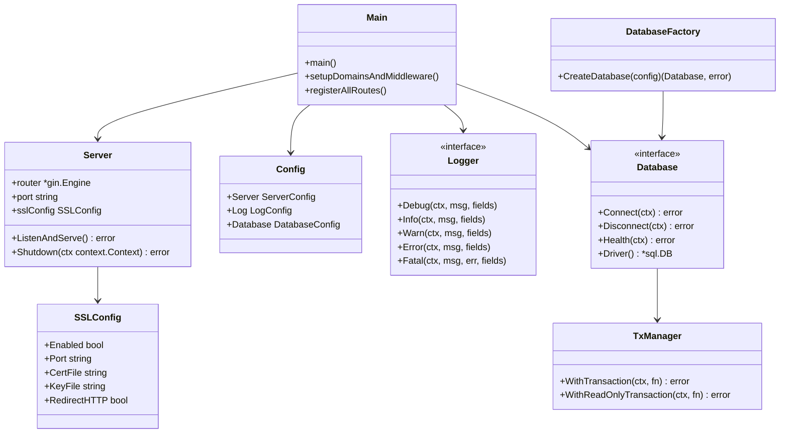

### **2. Health Domain Architecture**

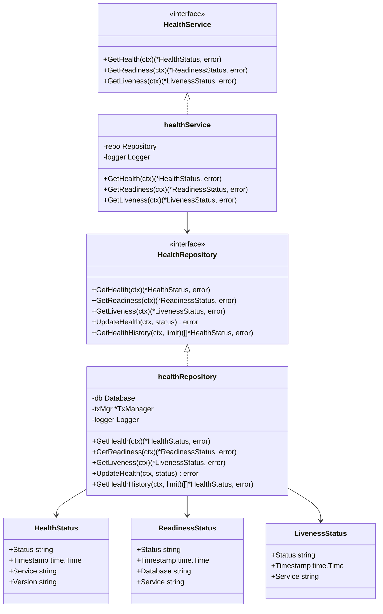

### **3. Database Layer Architecture**

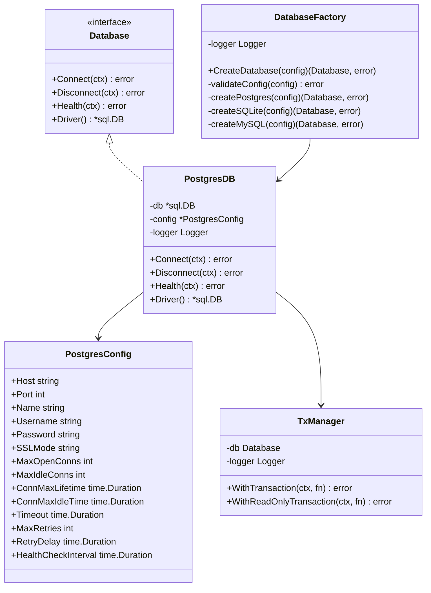

---

## 🔄 **Execution Flow Diagrams**

### **1. Service Startup Flow**

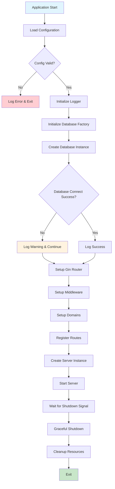

### **2. HTTP Request Flow**

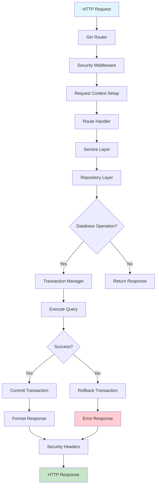

### **3. Health Check Flow**

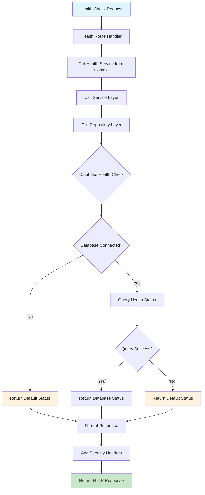

---

## 🔗 **Component Communication Diagrams**

### **1. Service Component Communication Flow**

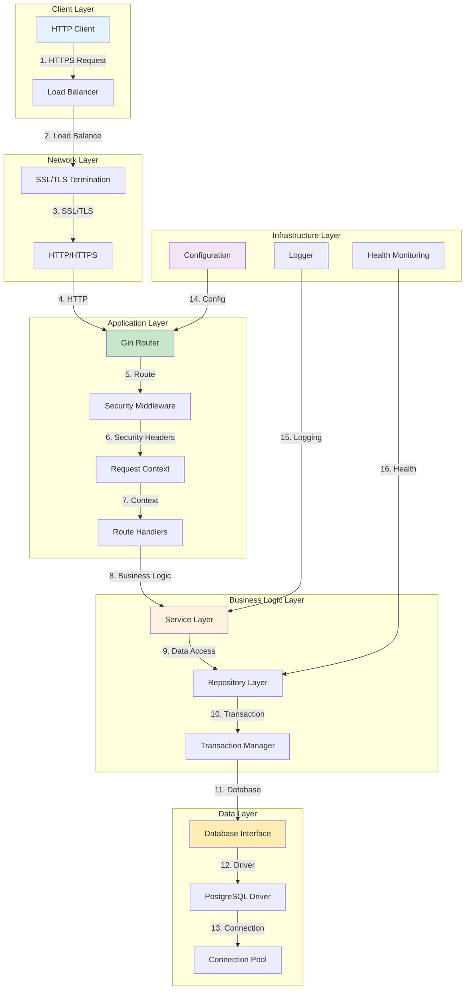

### **2. Detailed Component Flow with Numbers**

```mermaid
graph LR
    subgraph "Request Flow"
        A1[1. HTTP Request] --> A2[2. Router]
        A2 --> A3[3. Middleware]
        A3 --> A4[4. Handler]
    end
    
    subgraph "Service Flow"
        B1[5. Service Call] --> B2[6. Repository]
        B2 --> B3[7. Transaction]
        B3 --> B4[8. Database]
    end
    
    subgraph "Response Flow"
        C1[9. Result] --> C2[10. Format]
        C2 --> C3[11. Headers]
        C3 --> C4[12. Response]
    end
    
    A4 --> B1
    B4 --> C1
    
    style A1 fill:#e1f5fe
    style C4 fill:#c8e6c9
```

**Flow Description:**

1. **HTTP Request**: Client sends HTTP/HTTPS request to service
2. **Router**: Gin router matches request to appropriate handler
3. **Middleware**: Security headers, logging, and context setup
4. **Handler**: Route-specific handler processes request
5. **Service Call**: Business logic layer handles request
6. **Repository**: Data access layer queries database
7. **Transaction**: ACID-compliant transaction management
8. **Database**: PostgreSQL with connection pooling
9. **Result**: Database query result returned
10. **Format**: Response formatted according to API contract
11. **Headers**: Security headers added to response
12. **Response**: Final HTTP response sent to client

---

## 📊 **Sequence Diagrams**

### **1. Service Startup Sequence**

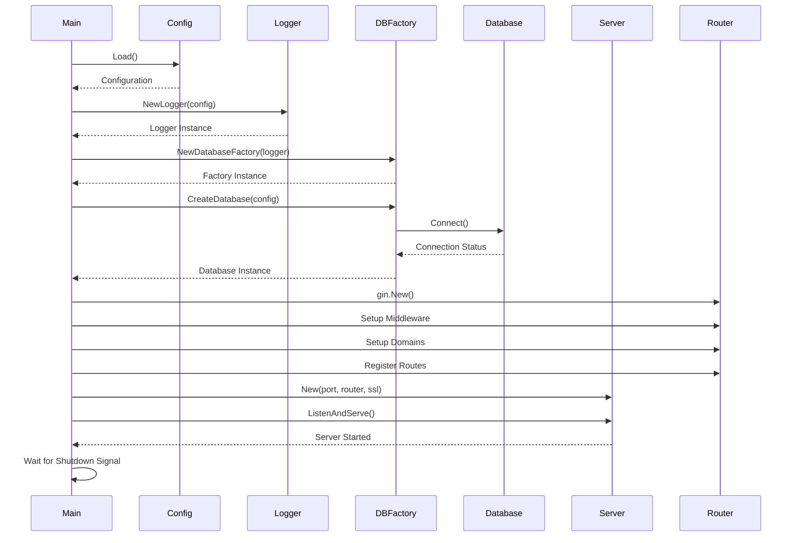

### **2. Health Check Request Sequence**

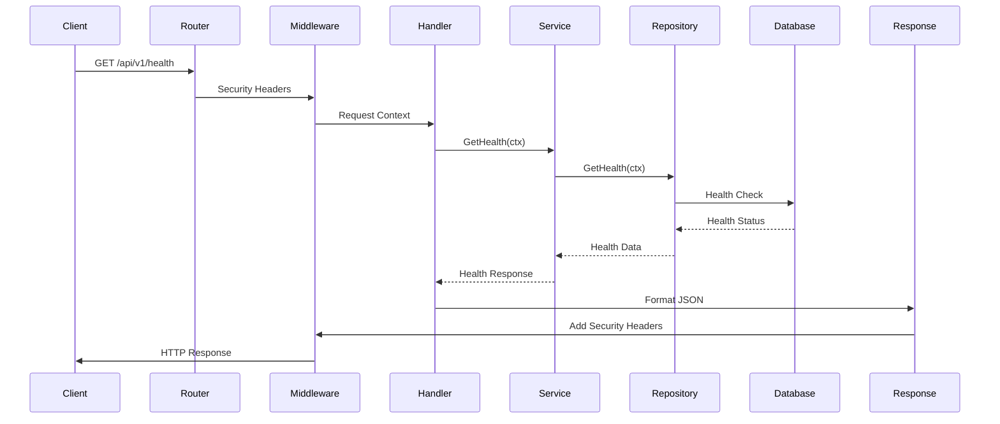

### **3. Database Transaction Sequence**

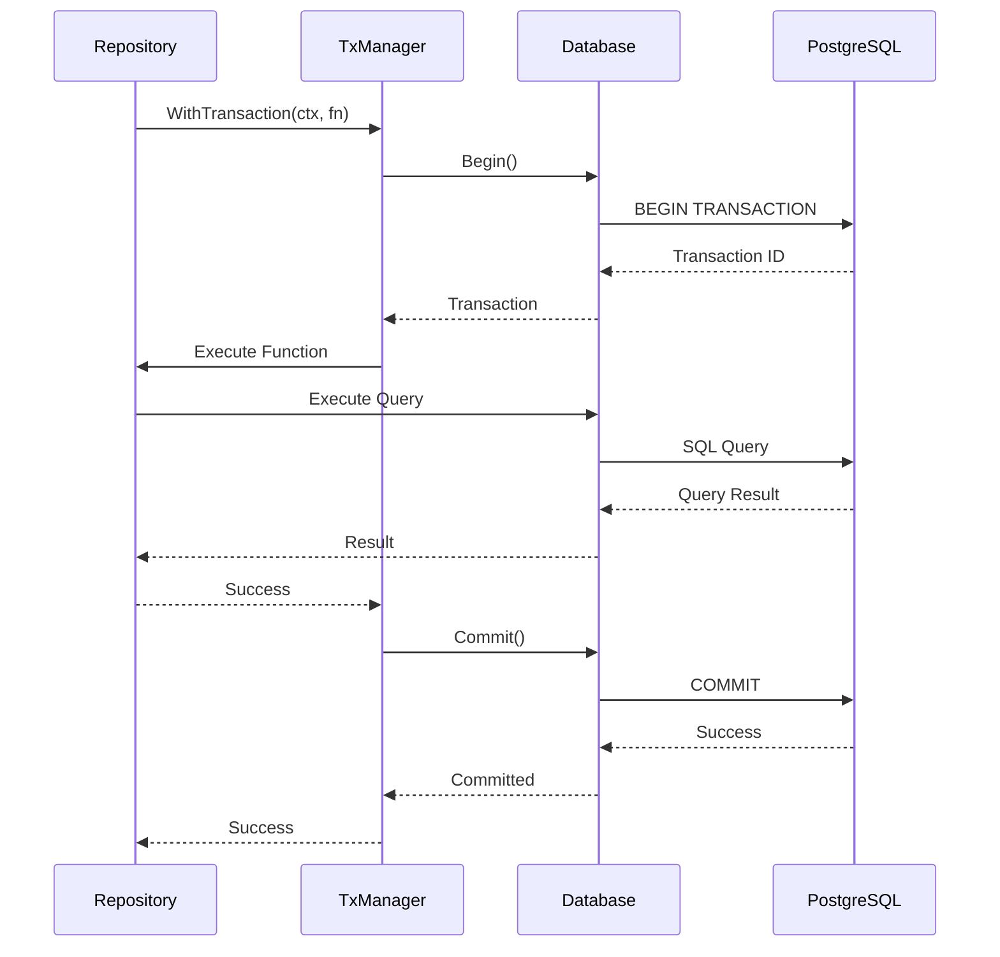

---

## ✨ **Feature Descriptions & Libraries**

### **1. Core Web Framework**

#### **Gin Web Framework**
- **Library**: `github.com/gin-gonic/gin v1.10.1`
- **Description**: High-performance HTTP web framework for Go
- **Features**:
  - Fast routing with minimal memory allocation
  - Middleware support for cross-cutting concerns
  - Built-in validation and binding
  - JSON/XML/ProtoBuf support
  - Graceful shutdown capabilities
  - SSL/TLS support with automatic HTTP to HTTPS redirect

#### **HTTP Server Management**
- **Library**: Standard `net/http` package
- **Description**: Custom server wrapper with lifecycle management
- **Features**:
  - Graceful shutdown with timeout
  - SSL/TLS configuration
  - HTTP to HTTPS redirect server
  - Connection pooling and timeout management

### **2. Configuration Management**

#### **Viper Configuration**
- **Library**: `github.com/spf13/viper v1.20.1`
- **Description**: Complete configuration solution for Go applications
- **Features**:
  - Multiple configuration file formats (JSON, YAML, TOML)
  - Environment variable overrides
  - Configuration file watching and hot reload
  - Default value management
  - Type-safe configuration structures
  - Configuration validation

#### **Configuration Structure**
- **Server Configuration**: Port, mode, SSL settings
- **Database Configuration**: Multi-database support with type-specific settings
- **Logging Configuration**: Level, format, output, rotation settings
- **SSL/TLS Configuration**: Certificate paths, ports, redirect settings

### **3. Database Management**

#### **Database Factory Pattern**
- **Library**: Custom implementation with `database/sql`
- **Description**: Pluggable database architecture supporting multiple database types
- **Features**:
  - PostgreSQL, SQLite, and MySQL support
  - Configuration-driven database selection
  - Connection pooling and management
  - Health monitoring and connection validation
  - Retry logic with exponential backoff

#### **PostgreSQL Driver**
- **Library**: `github.com/lib/pq v1.10.9`
- **Description**: Pure Go PostgreSQL driver
- **Features**:
  - Connection pooling with configurable limits
  - SSL/TLS support for secure connections
  - Prepared statement support
  - Transaction management
  - Health check integration

#### **Transaction Management**
- **Library**: Custom implementation with `database/sql`
- **Description**: ACID-compliant transaction handling
- **Features**:
  - Automatic rollback on errors
  - Read-only transaction support
  - Context-based timeout management
  - Panic recovery and cleanup
  - Nested transaction support

### **4. Logging & Observability**

#### **Structured Logging**
- **Library**: `go.uber.org/zap v1.27.0`
- **Description**: Fast, structured, leveled logging in Go
- **Features**:
  - High-performance logging with minimal allocations
  - Structured logging with field support
  - Multiple output formats (JSON, console)
  - Log level management
  - Caller information and stack traces

#### **Log Rotation**
- **Library**: `gopkg.in/natefinch/lumberjack.v2 v2.2.1`
- **Description**: Log rotation and compression
- **Features**:
  - Automatic log file rotation by size
  - Configurable backup retention
  - Log compression for storage efficiency
  - Age-based log cleanup
  - Concurrent-safe logging

### **5. Security & Middleware**

#### **Security Headers**
- **Library**: Custom implementation with Gin middleware
- **Description**: OWASP-compliant security headers
- **Features**:
  - HSTS (HTTP Strict Transport Security)
  - X-Content-Type-Options
  - X-Frame-Options
  - X-XSS-Protection
  - Referrer-Policy
  - Content-Security-Policy
  - Permissions-Policy

#### **SSL/TLS Support**
- **Library**: Gin built-in TLS support
- **Description**: Enterprise-grade SSL/TLS implementation
- **Features**:
  - Automatic certificate loading from files
  - HTTP to HTTPS redirect
  - TLS 1.2+ support
  - Strong cipher suite configuration
  - Certificate validation and renewal support

### **6. Health Monitoring**

#### **Health Check System**
- **Library**: Custom implementation
- **Description**: Comprehensive health monitoring for Kubernetes deployments
- **Features**:
  - Overall health status endpoint
  - Readiness probe for traffic routing
  - Liveness probe for container health
  - Database connection monitoring
  - Service version tracking
  - Health status history

#### **Database Health Monitoring**
- **Library**: Custom implementation with database drivers
- **Description**: Real-time database health assessment
- **Features**:
  - Connection pool statistics
  - Query performance monitoring
  - Connection failure detection
  - Automatic health status updates
  - Health check integration

### **7. Testing & Quality Assurance**

#### **Testing Framework**
- **Library**: `github.com/stretchr/testify v1.10.0`
- **Description**: Comprehensive testing toolkit for Go
- **Features**:
  - Assertion library for test validation
  - Mocking framework for dependency isolation
  - Test suite organization
  - Benchmark testing support
  - Test coverage analysis

#### **Unit Testing**
- **Library**: Go standard testing package
- **Description**: Comprehensive unit test coverage
- **Features**:
  - Interface-based testing
  - Mock database implementations
  - Middleware testing
  - Configuration testing
  - Error scenario testing

---

## 🏛️ **Architecture Patterns**

### **1. Clean Architecture**
- **Separation of Concerns**: Clear boundaries between layers
- **Dependency Inversion**: High-level modules depend on abstractions
- **Interface Segregation**: Focused interfaces for specific use cases
- **Single Responsibility**: Each component has one clear purpose

### **2. Domain-Driven Design**
- **Domain Models**: Business entities and value objects
- **Repository Pattern**: Data access abstraction
- **Service Layer**: Business logic orchestration
- **Domain Services**: Cross-cutting business concerns

### **3. Factory Pattern**
- **Database Factory**: Pluggable database implementations
- **Configuration Factory**: Environment-aware configuration
- **Logger Factory**: Configurable logging instances
- **Service Factory**: Dependency injection and instantiation

### **4. Middleware Pattern**
- **Cross-cutting Concerns**: Security, logging, monitoring
- **Chain of Responsibility**: Request processing pipeline
- **Decorator Pattern**: Request/response modification
- **Aspect-Oriented Programming**: Separation of concerns

---

## 🔒 **Security Architecture**

### **1. Transport Security**
- **SSL/TLS 1.2+**: Strong encryption protocols
- **Certificate Management**: File-based certificate loading
- **HSTS**: HTTP Strict Transport Security enforcement
- **HTTP to HTTPS Redirect**: Automatic security upgrade

### **2. Application Security**
- **Security Headers**: OWASP-compliant protection
- **Input Validation**: Request parameter validation
- **SQL Injection Prevention**: Parameterized queries
- **XSS Protection**: Content Security Policy headers

### **3. Infrastructure Security**
- **File Permissions**: Secure certificate and key file access
- **Environment Variables**: Sensitive configuration management
- **Network Security**: Firewall and network isolation
- **Access Control**: Service-to-service authentication

---

## 🚀 **Performance & Scalability**

### **1. Performance Optimizations**
- **Connection Pooling**: Efficient database connection management
- **Structured Logging**: High-performance logging with minimal overhead
- **Gin Framework**: Fast HTTP routing and processing
- **Memory Management**: Efficient memory allocation and garbage collection

### **2. Scalability Features**
- **Stateless Design**: Horizontal scaling support
- **Database Sharding**: Multi-database architecture
- **Load Balancing**: Kubernetes-ready deployment
- **Health Monitoring**: Automatic failure detection and recovery

### **3. Resource Management**
- **Connection Limits**: Configurable connection pool sizes
- **Timeout Management**: Request and transaction timeouts
- **Memory Limits**: Configurable memory usage limits
- **CPU Optimization**: Efficient goroutine management

---

## 🚀 **Deployment Architecture**

### **1. Container Deployment**
- **Docker Support**: Multi-stage Docker builds
- **Kubernetes Ready**: Health check integration
- **Environment Configuration**: ConfigMap and Secret support
- **Resource Limits**: CPU and memory constraints

### **2. Production Features**
- **Graceful Shutdown**: Signal handling and cleanup
- **Health Monitoring**: Readiness and liveness probes
- **Logging**: Structured logging with rotation
- **Metrics**: Health status and performance metrics

### **3. Configuration Management**
- **Environment Variables**: Production deployment flexibility
- **Configuration Files**: JSON and YAML support
- **Validation**: Configuration validation and error handling
- **Hot Reload**: Configuration change detection

---

## 📝 **Conclusion**

This architectural specification provides a comprehensive overview of the Tushar Template Gin microservice architecture. The service implements industry best practices for:

- **Clean Architecture**: Clear separation of concerns and dependencies
- **Security**: Enterprise-grade SSL/TLS and security headers
- **Performance**: High-performance web framework and database management
- **Scalability**: Kubernetes-ready deployment and horizontal scaling
- **Maintainability**: Well-structured code with comprehensive testing
- **Observability**: Structured logging and health monitoring

The service is production-ready and follows Go community best practices for building enterprise-grade microservices.
