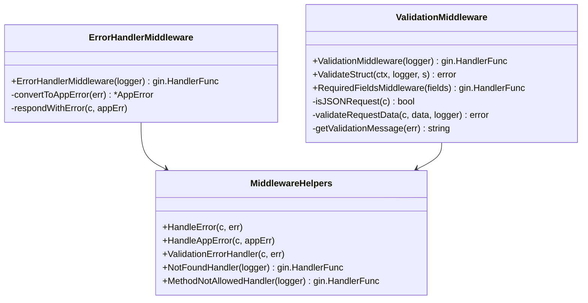
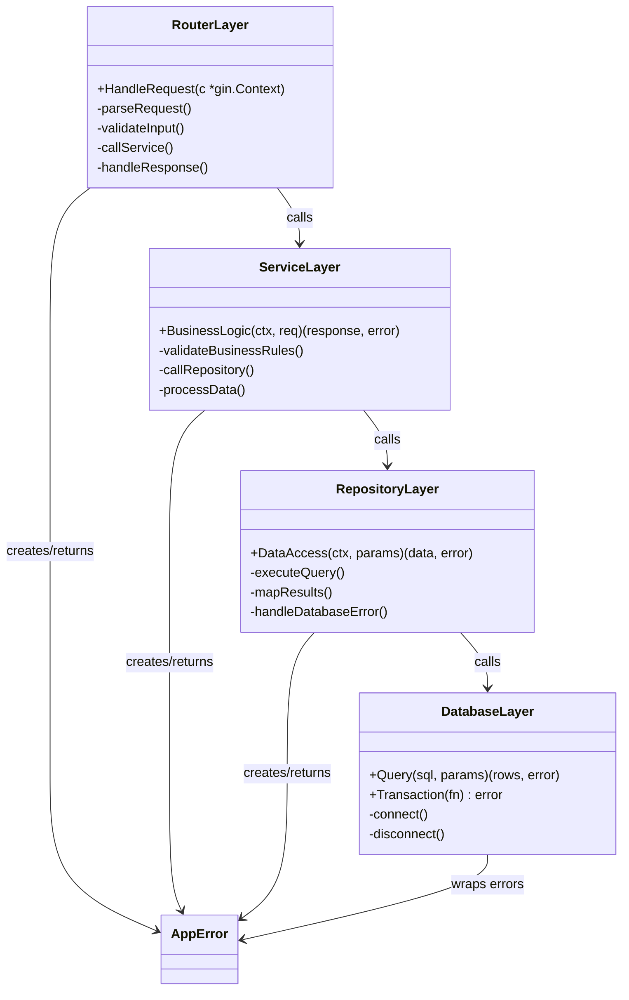
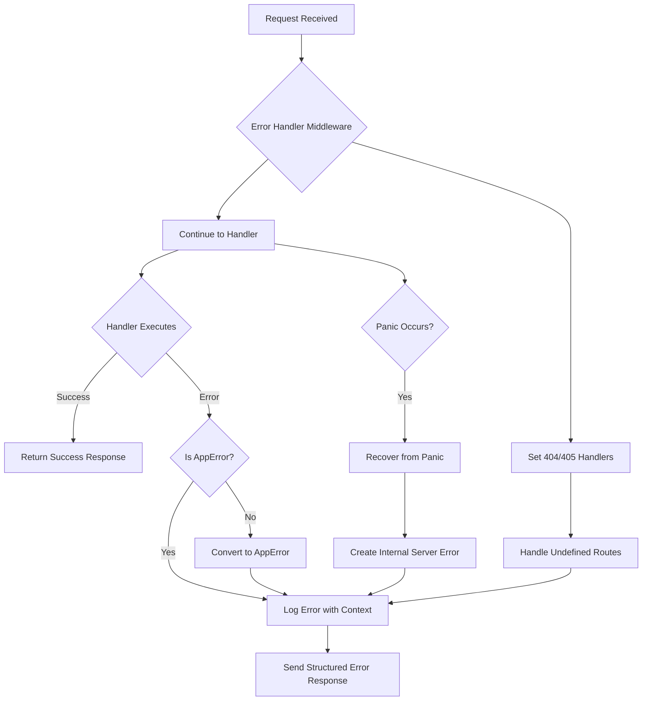
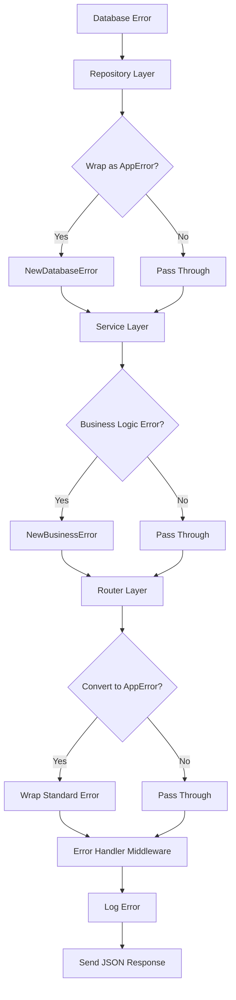
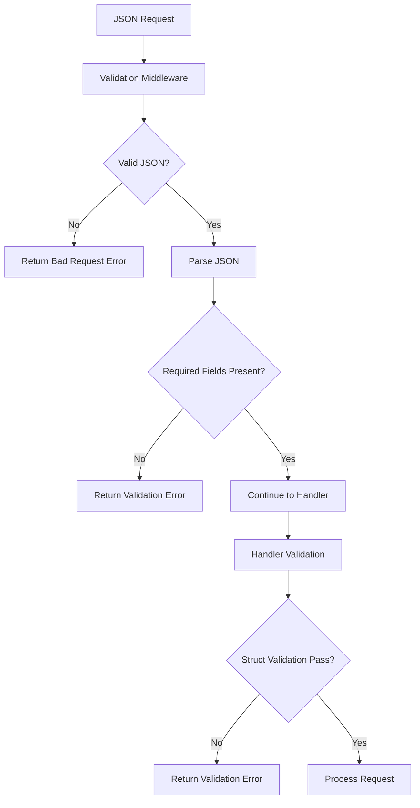
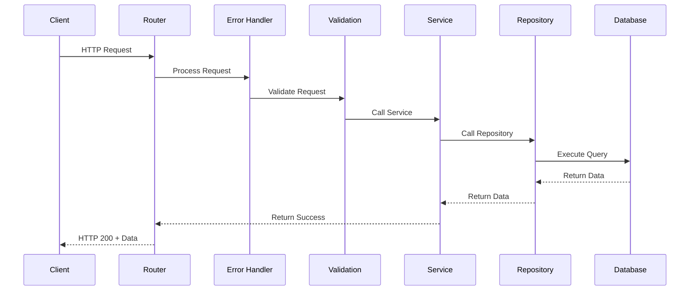
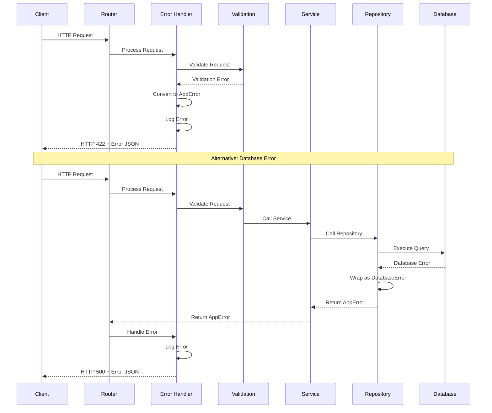
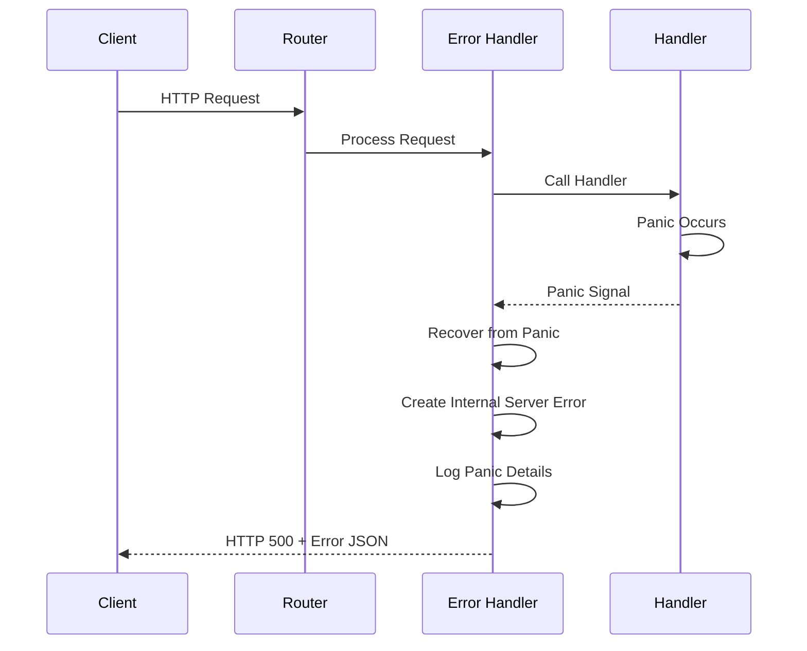

# Error Handling System Design Document

## Table of Contents
1. [Overview](#overview)
2. [Architecture](#architecture)
3. [Class Diagrams](#class-diagrams)
4. [Flow Charts](#flow-charts)
5. [Sequence Diagrams](#sequence-diagrams)
6. [Error Propagation Flow](#error-propagation-flow)
7. [Standard Practices](#standard-practices)
8. [Usage Examples by Layer](#usage-examples-by-layer)
9. [Defining New Errors](#defining-new-errors)
10. [Testing Strategy](#testing-strategy)
11. [Best Practices](#best-practices)

## Overview

The Error Handling System provides a structured, consistent approach to error management across all layers of the application. It ensures proper error propagation, logging, and client response formatting.

### Key Features
- **Structured Error Types**: Custom `AppError` with standardized codes
- **Centralized Handling**: Middleware-based error processing
- **Layer Separation**: Clear error boundaries between layers
- **Context Preservation**: Rich error context and tracing
- **Consistent Responses**: Standardized JSON error format

## Architecture

```
┌─────────────────────────────────────────────────────────────┐
│                    Error Handling Architecture              │
├─────────────────────────────────────────────────────────────┤
│  Client Request → Router → Middleware → Handler → Service   │
│                     ↓         ↓         ↓        ↓         │
│  Client Response ← JSON ← Error Handler ← AppError ← Error  │
└─────────────────────────────────────────────────────────────┘
```

## Class Diagrams

### Core Error Classes

```mermaid
classDiagram
    class ErrorCode {
        <<enumeration>>
        +INTERNAL_SERVER_ERROR
        +BAD_REQUEST
        +NOT_FOUND
        +VALIDATION_FAILED
        +PRODUCT_NOT_FOUND
        +DATABASE_ERROR
    }

    class AppError {
        -Code: ErrorCode
        -Message: string
        -Details: string
        -HTTPStatus: int
        -Fields: map[string]interface{}
        -Err: error
        +Error() string
        +Unwrap() error
        +ToJSON() []byte
        +WithField(key, value) AppError
        +WithFields(fields) AppError
        +WithDetails(details) AppError
    }

    class ErrorConstructors {
        +New(code, message, httpStatus) AppError
        +NewWithDetails(code, message, details, httpStatus) AppError
        +NewWithError(code, message, httpStatus, err) AppError
        +NewBadRequest(message) AppError
        +NewNotFound(message) AppError
        +NewInternalServerError(message) AppError
        +NewProductNotFound(id) AppError
        +NewDatabaseError(operation, err) AppError
    }

    class ErrorHelpers {
        +IsAppError(err) bool
        +GetAppError(err) *AppError
        +WrapError(err, code, message, httpStatus) AppError
    }

    AppError --> ErrorCode
    ErrorConstructors --> AppError
    ErrorHelpers --> AppError
```

### Middleware Classes



### Layer Architecture



## Flow Charts

### Error Handling Flow



### Error Propagation Flow



### Validation Flow



## Sequence Diagrams

### Successful Request Flow



### Error Handling Flow



### Panic Recovery Flow



## Error Propagation Flow

### Layer-by-Layer Error Handling

```
┌─────────────────────────────────────────────────────────────┐
│                    ERROR PROPAGATION FLOW                  │
├─────────────────────────────────────────────────────────────┤
│                                                             │
│  Database Layer                                             │
│  ├─ Raw database errors (sql.ErrNoRows, connection errors) │
│  └─ Wrap with NewDatabaseError()                           │
│                              ↓                             │
│  Repository Layer                                           │
│  ├─ Catch database errors                                   │
│  ├─ Add operation context                                   │
│  └─ Return AppError with context                           │
│                              ↓                             │
│  Service Layer                                              │
│  ├─ Catch repository errors                                 │
│  ├─ Add business logic context                             │
│  ├─ Create business-specific errors                         │
│  └─ Return AppError                                        │
│                              ↓                             │
│  Router Layer                                               │
│  ├─ Catch service errors                                    │
│  ├─ Convert standard errors to AppError                    │
│  └─ Pass to Error Handler Middleware                       │
│                              ↓                             │
│  Error Handler Middleware                                   │
│  ├─ Log error with full context                            │
│  ├─ Format error response                                  │
│  └─ Send JSON response to client                           │
│                                                             │
└─────────────────────────────────────────────────────────────┘
```

### Error Context Preservation

```
┌─────────────────────────────────────────────────────────────┐
│                ERROR CONTEXT PRESERVATION                  │
├─────────────────────────────────────────────────────────────┤
│                                                             │
│  Database Error: "connection timeout"                      │
│  ├─ Repository adds: operation="get product by ID"         │
│  ├─ Service adds: user_id=123, product_id=456              │
│  ├─ Router adds: correlation_id=abc-123                    │
│  └─ Middleware adds: timestamp, stack trace                │
│                                                             │
│  Final Error Response:                                      │
│  {                                                          │
│    "error": "DATABASE_CONNECTION_ERROR",                   │
│    "message": "Database operation failed",                 │
│    "details": "connection timeout",                        │
│    "fields": {                                              │
│      "operation": "get product by ID",                     │
│      "user_id": 123,                                       │
│      "product_id": 456,                                    │
│      "correlation_id": "abc-123"                           │
│    }                                                       │
│  }                                                          │
│                                                             │
└─────────────────────────────────────────────────────────────┘
```

## Standard Practices

### 1. Error Creation Guidelines

#### Repository Layer
```go
// ✅ Good: Wrap database errors with context
func (r *ProductRepository) GetByID(ctx context.Context, id int64) (*Product, error) {
    var product Product
    err := r.db.QueryRow(ctx, "SELECT * FROM products WHERE id = $1", id).Scan(&product)
    if err != nil {
        if err == sql.ErrNoRows {
            return nil, errors.NewProductNotFound(id)
        }
        return nil, errors.NewDatabaseError("get product by ID", err)
    }
    return &product, nil
}

// ❌ Bad: Return raw database errors
func (r *ProductRepository) GetByID(ctx context.Context, id int64) (*Product, error) {
    // ... database query
    return nil, err // Raw error without context
}
```

#### Service Layer
```go
// ✅ Good: Business logic error handling
func (s *ProductService) CreateProduct(ctx context.Context, req *CreateProductRequest) (*Product, error) {
    // Check business rules
    exists, err := s.repo.SKUExists(ctx, req.SKU, nil)
    if err != nil {
        return nil, errors.NewDatabaseError("check SKU existence", err)
    }
    
    if exists {
        return nil, errors.NewProductSKUExists(req.SKU)
    }
    
    // Create product
    product, err := s.repo.Create(ctx, product)
    if err != nil {
        return nil, errors.NewDatabaseError("create product", err)
    }
    
    return product, nil
}
```

#### Router Layer
```go
// ✅ Good: Convert and handle errors
func createProductHandler(c *gin.Context) {
    var req CreateProductRequest
    if err := c.ShouldBindJSON(&req); err != nil {
        middleware.HandleAppError(c, errors.NewBadRequestWithDetails("Invalid request body", err.Error()))
        return
    }
    
    product, err := productService.CreateProduct(ctx, &req)
    if err != nil {
        if appErr := errors.GetAppError(err); appErr != nil {
            middleware.HandleAppError(c, appErr)
        } else {
            middleware.HandleAppError(c, errors.NewInternalServerErrorWithError("Failed to create product", err))
        }
        return
    }
    
    c.JSON(http.StatusCreated, product)
}
```

### 2. Middleware Order

```go
// ✅ Correct middleware order
router.Use(middleware.ErrorHandlerMiddleware(logger))      // 1st - catches all errors
router.Use(middleware.CorrelationIDMiddleware())           // 2nd - adds correlation IDs
router.Use(middleware.SecurityHeaders())                   // 3rd - adds security headers
router.Use(middleware.ValidationMiddleware(logger))        // 4th - validates requests
```

### 3. Error Logging

```go
// ✅ Good: Structured logging with context
s.logger.Error(ctx, "Failed to create product", interfaces.Fields{
    "error": err.Error(),
    "sku": req.SKU,
    "user_id": userID,
    "operation": "create_product",
})

// ❌ Bad: Unstructured logging
log.Printf("Error: %v", err)
```

## Usage Examples by Layer

### 1. Database Layer

```go
// Database connection error
func (db *Database) Connect(ctx context.Context) error {
    err := db.conn.Ping(ctx)
    if err != nil {
        return errors.NewDatabaseError("connect to database", err)
    }
    return nil
}

// Query execution error
func (db *Database) Query(ctx context.Context, sql string, args ...interface{}) (*sql.Rows, error) {
    rows, err := db.conn.Query(ctx, sql, args...)
    if err != nil {
        return nil, errors.NewDatabaseError("execute query", err)
    }
    return rows, nil
}
```

### 2. Repository Layer

```go
// Not found error
func (r *ProductRepository) GetByID(ctx context.Context, id int64) (*Product, error) {
    var product Product
    err := r.db.QueryRow(ctx, "SELECT * FROM products WHERE id = $1", id).Scan(&product)
    if err != nil {
        if err == sql.ErrNoRows {
            return nil, errors.NewProductNotFound(id)
        }
        return nil, errors.NewDatabaseError("get product by ID", err)
    }
    return &product, nil
}

// Constraint violation error
func (r *ProductRepository) Create(ctx context.Context, product *Product) (*Product, error) {
    err := r.db.QueryRow(ctx, "INSERT INTO products (...) VALUES (...) RETURNING id", ...).Scan(&product.ID)
    if err != nil {
        if isUniqueConstraintViolation(err) {
            return nil, errors.NewProductSKUExists(product.SKU)
        }
        return nil, errors.NewDatabaseError("create product", err)
    }
    return product, nil
}
```

### 3. Service Layer

```go
// Business logic validation
func (s *ProductService) CreateProduct(ctx context.Context, req *CreateProductRequest) (*Product, error) {
    // Validate business rules
    if req.Price < 0 {
        return nil, errors.NewValidationErrorWithDetails("Invalid price", "Price must be positive").
            WithField("price", req.Price)
    }
    
    // Check SKU uniqueness
    exists, err := s.repo.SKUExists(ctx, req.SKU, nil)
    if err != nil {
        return nil, errors.NewDatabaseError("check SKU existence", err)
    }
    
    if exists {
        return nil, errors.NewProductSKUExists(req.SKU)
    }
    
    // Create product
    product, err := s.repo.Create(ctx, product)
    if err != nil {
        return nil, err // Already wrapped as AppError
    }
    
    return product, nil
}

// Complex business logic with multiple error types
func (s *ProductService) UpdateStock(ctx context.Context, id int64, stock int) error {
    // Validate stock
    if stock < 0 {
        return errors.NewInvalidStock(stock)
    }
    
    // Check if product exists
    product, err := s.repo.GetByID(ctx, id)
    if err != nil {
        return err // Already wrapped as AppError
    }
    
    // Business rule: Can't set stock to 0 if product is active
    if stock == 0 && product.IsActive {
        return errors.NewValidationErrorWithDetails("Cannot set stock to zero for active product", 
            "Deactivate product before setting stock to zero").
            WithField("product_id", id).
            WithField("is_active", product.IsActive)
    }
    
    // Update stock
    err = s.repo.UpdateStock(ctx, id, stock)
    if err != nil {
        return errors.NewDatabaseError("update stock", err)
    }
    
    return nil
}
```

### 4. Router Layer

```go
// Request validation
func createProductHandler(c *gin.Context) {
    var req CreateProductRequest
    if err := c.ShouldBindJSON(&req); err != nil {
        middleware.HandleAppError(c, errors.NewBadRequestWithDetails("Invalid request body", err.Error()))
        return
    }
    
    // Call service
    product, err := productService.CreateProduct(c.Request.Context(), &req)
    if err != nil {
        // Check if it's already an AppError
        if appErr := errors.GetAppError(err); appErr != nil {
            middleware.HandleAppError(c, appErr)
        } else {
            middleware.HandleAppError(c, errors.NewInternalServerErrorWithError("Failed to create product", err))
        }
        return
    }
    
    c.JSON(http.StatusCreated, ProductResponse{Product: *product})
}

// Parameter validation
func getProductHandler(c *gin.Context) {
    idStr := c.Param("id")
    id, err := strconv.ParseInt(idStr, 10, 64)
    if err != nil {
        middleware.HandleAppError(c, errors.NewBadRequestWithDetails("Invalid product ID", "Product ID must be a valid integer"))
        return
    }
    
    product, err := productService.GetProduct(c.Request.Context(), id)
    if err != nil {
        if appErr := errors.GetAppError(err); appErr != nil {
            middleware.HandleAppError(c, appErr)
        } else {
            middleware.HandleAppError(c, errors.NewInternalServerErrorWithError("Failed to get product", err))
        }
        return
    }
    
    c.JSON(http.StatusOK, ProductResponse{Product: *product})
}
```

### 5. Middleware Layer

```go
// Custom validation middleware
func ValidateProductRequest() gin.HandlerFunc {
    return gin.HandlerFunc(func(c *gin.Context) {
        if c.Request.Method != "POST" && c.Request.Method != "PUT" {
            c.Next()
            return
        }
        
        var req CreateProductRequest
        if err := c.ShouldBindJSON(&req); err != nil {
            middleware.HandleAppError(c, errors.NewValidationErrorWithDetails("Invalid product request", err.Error()))
            c.Abort()
            return
        }
        
        // Custom validation
        if req.Name == "" {
            middleware.HandleAppError(c, errors.NewValidationErrorWithDetails("Product name is required", "Name cannot be empty"))
            c.Abort()
            return
        }
        
        c.Next()
    })
}
```

## Defining New Errors

### 1. Adding New Error Codes

```go
// In pkg/errors/app_error.go
const (
    // Existing error codes...
    ErrCodeInternalServer      ErrorCode = "INTERNAL_SERVER_ERROR"
    ErrCodeBadRequest          ErrorCode = "BAD_REQUEST"
    
    // New error codes
    ErrCodeUserNotFound        ErrorCode = "USER_NOT_FOUND"
    ErrCodeInsufficientFunds   ErrorCode = "INSUFFICIENT_FUNDS"
    ErrCodeOrderProcessing     ErrorCode = "ORDER_PROCESSING_ERROR"
    ErrCodePaymentFailed       ErrorCode = "PAYMENT_FAILED"
)
```

### 2. Creating Constructor Functions

```go
// Business logic error constructors
func NewUserNotFound(id interface{}) *AppError {
    return NewNotFoundWithDetails("User not found", fmt.Sprintf("User with ID %v not found", id)).
        WithField("user_id", id)
}

func NewInsufficientFunds(required, available float64) *AppError {
    return NewBadRequestWithDetails("Insufficient funds", 
        fmt.Sprintf("Required: $%.2f, Available: $%.2f", required, available)).
        WithField("required_amount", required).
        WithField("available_amount", available)
}

func NewOrderProcessingError(orderID string, err error) *AppError {
    return NewInternalServerErrorWithError("Order processing failed", err).
        WithField("order_id", orderID)
}

func NewPaymentFailed(transactionID string, reason string) *AppError {
    return NewBadRequestWithDetails("Payment failed", reason).
        WithField("transaction_id", transactionID).
        WithField("failure_reason", reason)
}
```

### 3. Using New Errors

```go
// In service layer
func (s *OrderService) ProcessOrder(ctx context.Context, orderID string, userID int64) error {
    // Check if user exists
    user, err := s.userRepo.GetByID(ctx, userID)
    if err != nil {
        if errors.GetAppError(err) != nil && errors.GetAppError(err).Code == errors.ErrCodeNotFound {
            return errors.NewUserNotFound(userID)
        }
        return errors.NewDatabaseError("get user", err)
    }
    
    // Check funds
    if user.Balance < order.TotalAmount {
        return errors.NewInsufficientFunds(order.TotalAmount, user.Balance)
    }
    
    // Process payment
    err = s.paymentService.ProcessPayment(ctx, orderID, order.TotalAmount)
    if err != nil {
        return errors.NewPaymentFailed(orderID, err.Error())
    }
    
    return nil
}
```

### 4. Error Code Categories

```go
// Group error codes by category for better organization
const (
    // HTTP Status Errors (4xx, 5xx)
    ErrCodeBadRequest          ErrorCode = "BAD_REQUEST"
    ErrCodeUnauthorized        ErrorCode = "UNAUTHORIZED"
    ErrCodeForbidden           ErrorCode = "FORBIDDEN"
    ErrCodeNotFound            ErrorCode = "NOT_FOUND"
    ErrCodeInternalServer      ErrorCode = "INTERNAL_SERVER_ERROR"
    
    // Validation Errors
    ErrCodeValidationFailed    ErrorCode = "VALIDATION_FAILED"
    ErrCodeInvalidParameter    ErrorCode = "INVALID_PARAMETER"
    ErrCodeMissingParameter    ErrorCode = "MISSING_PARAMETER"
    
    // Business Logic Errors
    ErrCodeProductNotFound     ErrorCode = "PRODUCT_NOT_FOUND"
    ErrCodeProductSKUExists    ErrorCode = "PRODUCT_SKU_EXISTS"
    ErrCodeUserNotFound        ErrorCode = "USER_NOT_FOUND"
    ErrCodeInsufficientFunds   ErrorCode = "INSUFFICIENT_FUNDS"
    
    // Database Errors
    ErrCodeDatabaseConnection  ErrorCode = "DATABASE_CONNECTION_ERROR"
    ErrCodeDatabaseQuery       ErrorCode = "DATABASE_QUERY_ERROR"
    ErrCodeDatabaseTransaction ErrorCode = "DATABASE_TRANSACTION_ERROR"
    
    // External Service Errors
    ErrCodePaymentService      ErrorCode = "PAYMENT_SERVICE_ERROR"
    ErrCodeEmailService        ErrorCode = "EMAIL_SERVICE_ERROR"
    ErrCodeNotificationService ErrorCode = "NOTIFICATION_SERVICE_ERROR"
)
```

## Testing Strategy

### 1. Unit Tests for Error Creation

```go
func TestNewProductNotFound(t *testing.T) {
    err := errors.NewProductNotFound(123)
    
    assert.Equal(t, errors.ErrCodeProductNotFound, err.Code)
    assert.Equal(t, "Product not found", err.Message)
    assert.Equal(t, http.StatusNotFound, err.HTTPStatus)
    assert.Equal(t, 123, err.Fields["product_id"])
}

func TestNewDatabaseError(t *testing.T) {
    originalErr := fmt.Errorf("connection timeout")
    err := errors.NewDatabaseError("get product", originalErr)
    
    assert.Equal(t, errors.ErrCodeInternalServer, err.Code)
    assert.Equal(t, "Database operation failed", err.Message)
    assert.Equal(t, http.StatusInternalServerError, err.HTTPStatus)
    assert.Equal(t, "get product", err.Fields["operation"])
    assert.Equal(t, originalErr, err.Unwrap())
}
```

### 2. Integration Tests for Error Handling

```go
func TestCreateProduct_ValidationError(t *testing.T) {
    // Setup
    server := setupTestServer()
    
    // Test
    resp := httptest.NewRecorder()
    req := httptest.NewRequest("POST", "/api/v1/products", strings.NewReader(`{"name": ""}`))
    server.ServeHTTP(resp, req)
    
    // Assert
    assert.Equal(t, http.StatusUnprocessableEntity, resp.Code)
    
    var errorResp map[string]interface{}
    json.Unmarshal(resp.Body.Bytes(), &errorResp)
    assert.Equal(t, "VALIDATION_FAILED", errorResp["error"])
}

func TestGetProduct_NotFound(t *testing.T) {
    // Setup
    server := setupTestServer()
    
    // Test
    resp := httptest.NewRecorder()
    req := httptest.NewRequest("GET", "/api/v1/products/999", nil)
    server.ServeHTTP(resp, req)
    
    // Assert
    assert.Equal(t, http.StatusNotFound, resp.Code)
    
    var errorResp map[string]interface{}
    json.Unmarshal(resp.Body.Bytes(), &errorResp)
    assert.Equal(t, "PRODUCT_NOT_FOUND", errorResp["error"])
    assert.Equal(t, float64(999), errorResp["fields"].(map[string]interface{})["product_id"])
}
```

### 3. Middleware Tests

```go
func TestErrorHandlerMiddleware_PanicRecovery(t *testing.T) {
    // Setup
    router := gin.New()
    router.Use(middleware.ErrorHandlerMiddleware(mockLogger))
    router.GET("/panic", func(c *gin.Context) {
        panic("test panic")
    })
    
    // Test
    resp := httptest.NewRecorder()
    req := httptest.NewRequest("GET", "/panic", nil)
    router.ServeHTTP(resp, req)
    
    // Assert
    assert.Equal(t, http.StatusInternalServerError, resp.Code)
    
    var errorResp map[string]interface{}
    json.Unmarshal(resp.Body.Bytes(), &errorResp)
    assert.Equal(t, "INTERNAL_SERVER_ERROR", errorResp["error"])
}
```

## Best Practices

### 1. Error Design Principles

- **Consistency**: Use the same error structure across all layers
- **Context**: Always include relevant context in error fields
- **Traceability**: Preserve error chains for debugging
- **User-Friendly**: Provide meaningful error messages
- **Logging**: Log errors with sufficient context for debugging

### 2. Error Code Naming

```go
// ✅ Good: Clear, descriptive error codes
ErrCodeProductNotFound
ErrCodeInsufficientFunds
ErrCodePaymentServiceUnavailable

// ❌ Bad: Vague or unclear error codes
ErrCodeError
ErrCodeBad
ErrCodeFail
```

### 3. Error Message Guidelines

```go
// ✅ Good: Clear, actionable error messages
"Product not found"
"Insufficient funds for this transaction"
"Payment service is currently unavailable"

// ❌ Bad: Vague or technical error messages
"Error occurred"
"Database error"
"Something went wrong"
```

### 4. Error Context Guidelines

```go
// ✅ Good: Include relevant context
errors.NewProductNotFound(id).
    WithField("user_id", userID).
    WithField("request_id", requestID).
    WithField("timestamp", time.Now())

// ❌ Bad: Missing context
errors.NewProductNotFound(id)
```

### 5. Error Handling Patterns

```go
// ✅ Good: Check error type before handling
if appErr := errors.GetAppError(err); appErr != nil {
    // Handle AppError
    middleware.HandleAppError(c, appErr)
} else {
    // Wrap standard error
    middleware.HandleAppError(c, errors.NewInternalServerErrorWithError("Operation failed", err))
}

// ❌ Bad: Always wrapping standard errors
middleware.HandleAppError(c, errors.NewInternalServerErrorWithError("Operation failed", err))
```

This design document provides a comprehensive guide for implementing and using the error handling system across all layers of your application. The system ensures consistency, traceability, and maintainability while providing rich context for debugging and monitoring.
