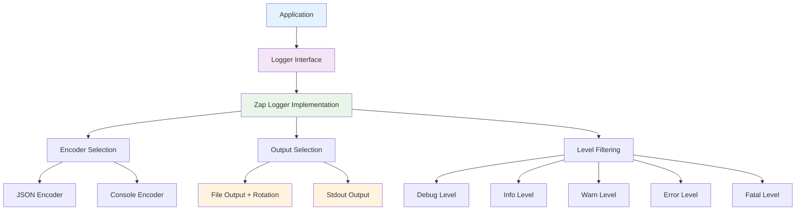
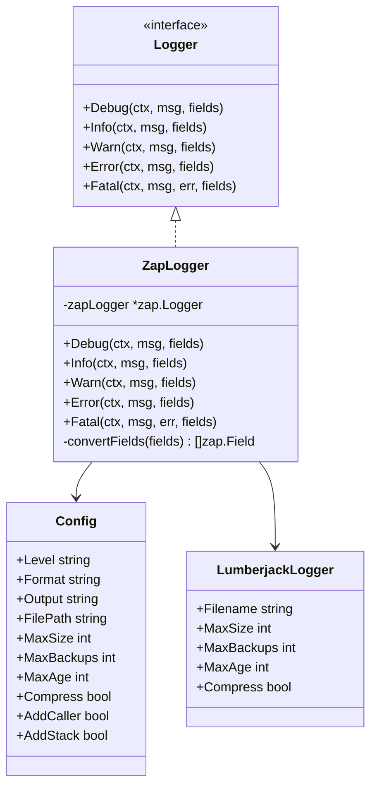
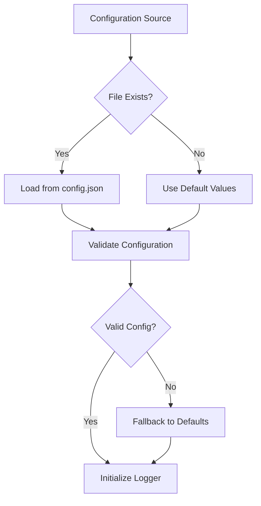
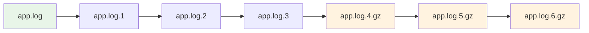

# 📝 **Logging Architecture & Design Specification**

> **📋 Comprehensive Logging System Design**: This document provides a complete architectural specification for the logging mechanism including supported levels, configurability, control mechanisms, and log location management.

**Version**: 1.0  
**Date**: January 19, 2025  
**Status**: Production Ready  
**Architecture**: Structured Logging with Zap + Lumberjack  
**Base Framework**: Uber Zap + Lumberjack for Rotation

---

## 📋 **Table of Contents**

1. [Logging System Overview](#logging-system-overview)
2. [Architecture Design](#architecture-design)
3. [Supported Logging Levels](#supported-logging-levels)
4. [Configuration Management](#configuration-management)
5. [Log Output Management](#log-output-management)
6. [Log Rotation & Retention](#log-rotation--retention)
7. [Structured Logging Features](#structured-logging-features)
8. [Performance & Security](#performance--security)
9. [Deployment Considerations](#deployment-considerations)
10. [Monitoring & Observability](#monitoring--observability)

---

## 🎯 **Logging System Overview**

### **Core Principles**
- **Structured Logging**: JSON and console formats for machine and human readability
- **Performance First**: High-performance logging with minimal overhead
- **Production Ready**: Log rotation, compression, and retention management
- **Flexible Configuration**: Runtime configuration through config files
- **Context Aware**: Request context and correlation ID support

### **Technology Stack**
- **Primary Logger**: Uber Zap (High-performance structured logging)
- **Rotation**: Lumberjack (Log file rotation and management)
- **Configuration**: Viper (Configuration management)
- **Integration**: Gin framework middleware support

---

## 🏗️ **Architecture Design**

### **High-Level Architecture**



### **Component Architecture**



---

## 📊 **Supported Logging Levels**

### **Log Level Hierarchy**

| Level | Value | Description | Use Case | Production Default |
|-------|-------|-------------|----------|-------------------|
| **Debug** | 0 | Detailed debugging information | Development, troubleshooting | ❌ Disabled |
| **Info** | 1 | General information messages | Application flow, metrics | ✅ Enabled |
| **Warn** | 2 | Warning messages | Non-critical issues | ✅ Enabled |
| **Error** | 3 | Error messages | Application errors | ✅ Enabled |
| **Fatal** | 4 | Fatal errors (exits app) | Critical failures | ✅ Enabled |

### **Level Filtering Behavior**

```go
// Example: Info level configured
logger.Info(ctx, "This will be logged")     // ✅ Logged
logger.Warn(ctx, "This will be logged")     // ✅ Logged  
logger.Error(ctx, "This will be logged")    // ✅ Logged
logger.Fatal(ctx, "This will be logged")    // ✅ Logged
logger.Debug(ctx, "This will NOT be logged") // ❌ Filtered out
```

### **Level Configuration Examples**

```json
// Development Environment
{
  "log": {
    "level": "debug"  // All levels including debug
  }
}

// Production Environment  
{
  "log": {
    "level": "info"   // Info and above only
  }
}

// Error-Only Environment
{
  "log": {
    "level": "error"  // Errors and fatal only
  }
}
```

---

## ⚙️ **Configuration Management**

### **Configuration Structure**

```go
type LogConfig struct {
    Level      string `mapstructure:"level"`      // Log level (debug, info, warn, error, fatal)
    Format     string `mapstructure:"format"`     // Log format (json, console)
    Output     string `mapstructure:"output"`     // Output destination (stdout, file)
    FilePath   string `mapstructure:"filePath"`   // Log file path (if output is file)
    MaxSize    int    `mapstructure:"maxSize"`    // Maximum log file size in MB
    MaxBackups int    `mapstructure:"maxBackups"` // Maximum number of backup files
    MaxAge     int    `mapstructure:"maxAge"`     // Maximum age of log files in days
    Compress   bool   `mapstructure:"compress"`   // Whether to compress old log files
    AddCaller  bool   `mapstructure:"addCaller"`  // Whether to add caller information
    AddStack   bool   `mapstructure:"addStack"`   // Whether to add stack traces
}
```

### **Configuration File Example**

```json
{
  "log": {
    "level": "info",
    "format": "json",
    "output": "file",
    "filePath": "/var/log/app/app.log",
    "maxSize": 100,
    "maxBackups": 3,
    "maxAge": 28,
    "compress": true,
    "addCaller": true,
    "addStack": false
  }
}
```

### **Configuration Priority**



---

## 📁 **Log Output Management**

### **Output Destination Options**

#### **1. Standard Output (stdout)**
```json
{
  "log": {
    "output": "stdout",
    "filePath": ""  // Ignored for stdout
  }
}
```

**Use Cases:**
- **Development**: Local development and testing
- **Docker**: Containerized applications
- **Kubernetes**: Pod logs collection
- **CI/CD**: Build and deployment logs

#### **2. File Output with Rotation**
```json
{
  "log": {
    "output": "file",
    "filePath": "/var/log/app/app.log"
  }
}
```

**Use Cases:**
- **Production**: Persistent log storage
- **On-Premise**: Local file system logging
- **Compliance**: Audit trail requirements
- **Debugging**: Long-term log analysis

### **File Path Configuration**

#### **Absolute Paths (Recommended)**
```json
{
  "log": {
    "filePath": "/var/log/app/app.log"
  }
}
```

#### **Relative Paths**
```json
{
  "log": {
    "filePath": "./logs/app.log"
  }
}
```

#### **Environment-Specific Paths**
```json
{
  "log": {
    "filePath": "/opt/app/logs/app.log"
  }
}
```

---

## 🔄 **Log Rotation & Retention**

### **Rotation Strategy**



### **Rotation Configuration**

| Parameter | Description | Default | Production Recommended |
|-----------|-------------|---------|------------------------|
| **MaxSize** | Maximum file size before rotation (MB) | 100 | 100-500 MB |
| **MaxBackups** | Maximum number of backup files | 3 | 5-10 files |
| **MaxAge** | Maximum age of backup files (days) | 28 | 30-90 days |
| **Compress** | Compress old backup files | true | true |

### **Rotation Examples**

#### **High-Volume Logging**
```json
{
  "log": {
    "maxSize": 500,      // 500 MB per file
    "maxBackups": 10,    // Keep 10 backup files
    "maxAge": 90,        // Keep for 90 days
    "compress": true     // Compress old files
  }
}
```

#### **Low-Volume Logging**
```json
{
  "log": {
    "maxSize": 100,      // 100 MB per file
    "maxBackups": 5,     // Keep 5 backup files
    "maxAge": 30,        // Keep for 30 days
    "compress": true     // Compress old files
  }
}
```

---

## 🏷️ **Structured Logging Features**

### **Log Format Options**

#### **1. JSON Format (Production)**
```json
{
  "timestamp": "2025-01-19T10:30:45.123Z",
  "level": "INFO",
  "message": "Database connection established",
  "fields": {
    "type": "postgres",
    "host": "localhost",
    "port": 5432,
    "duration": "45ms"
  },
  "caller": "main.go:67",
  "stacktrace": ""
}
```

#### **2. Console Format (Development)**
```
2025-01-19T10:30:45.123Z    INFO    Database connection established    {"type": "postgres", "host": "localhost", "port": 5432, "duration": "45ms"}    main.go:67
```

### **Structured Fields Support**

```go
// Example usage in code
logger.Info(ctx, "User authentication successful", logger.Fields{
    "user_id": "12345",
    "ip_address": "192.168.1.100",
    "user_agent": "Mozilla/5.0...",
    "duration": "150ms",
    "method": "POST",
    "endpoint": "/api/v1/auth/login"
})
```

### **Context-Aware Logging**

```go
// Request context with correlation ID
func (h *Handler) ProcessRequest(c *gin.Context) {
    ctx := c.Request.Context()
    
    logger.Info(ctx, "Processing request", logger.Fields{
        "request_id": c.GetString("request_id"),
        "user_id": c.GetString("user_id"),
        "method": c.Request.Method,
        "path": c.Request.URL.Path,
    })
}
```

---

## 🚀 **Performance & Security**

### **Performance Optimizations**

#### **1. Zero-Allocation Logging**
- **Zap Core**: High-performance logging with minimal allocations
- **Field Pooling**: Reuse field objects to reduce GC pressure
- **Async Logging**: Non-blocking log writes (optional)

#### **2. Memory Management**
```go
// Efficient field conversion
func convertFields(fields Fields) []zap.Field {
    zapFields := make([]zap.Field, 0, len(fields))
    for k, v := range fields {
        zapFields = append(zapFields, zap.Any(k, v))
    }
    return zapFields
}
```

### **Security Considerations**

#### **1. Sensitive Data Filtering**
```go
// Example: Filter sensitive fields
func sanitizeFields(fields logger.Fields) logger.Fields {
    sanitized := make(logger.Fields)
    for k, v := range fields {
        if isSensitiveField(k) {
            sanitized[k] = "[REDACTED]"
        } else {
            sanitized[k] = v
        }
    }
    return sanitized
}

func isSensitiveField(key string) bool {
    sensitive := []string{"password", "token", "secret", "key", "credential"}
    for _, s := range sensitive {
        if strings.Contains(strings.ToLower(key), s) {
            return true
        }
    }
    return false
}
```

#### **2. File Permissions**
```bash
# Secure log file permissions
chmod 640 /var/log/app/app.log
chown app:app /var/log/app/app.log
```

---

## 🐳 **Deployment Considerations**

### **Docker Container Logging**

#### **1. Container Logging Strategy**
```dockerfile
# Dockerfile logging configuration
ENV LOG_LEVEL=info
ENV LOG_FORMAT=json
ENV LOG_OUTPUT=stdout
```

#### **2. Volume Mounting for File Logs**
```yaml
# docker-compose.yml
version: '3.8'
services:
  app:
    image: tushar-template-gin:latest
    volumes:
      - ./logs:/var/log/app
    environment:
      - LOG_OUTPUT=file
      - LOG_FILEPATH=/var/log/app/app.log
```

### **Kubernetes Logging**

#### **1. ConfigMap Configuration**
```yaml
apiVersion: v1
kind: ConfigMap
metadata:
  name: app-logging-config
data:
  config.json: |
    {
      "log": {
        "level": "info",
        "format": "json",
        "output": "stdout",
        "addCaller": true,
        "addStack": false
      }
    }
```

#### **2. Persistent Volume for File Logs**
```yaml
apiVersion: v1
kind: PersistentVolumeClaim
metadata:
  name: app-logs-pvc
spec:
  accessModes:
    - ReadWriteOnce
  resources:
    requests:
      storage: 10Gi
```

---

## 📊 **Monitoring & Observability**

### **Log Analysis Tools**

#### **1. ELK Stack Integration**
```json
{
  "log": {
    "format": "json",
    "output": "file",
    "filePath": "/var/log/app/app.log"
  }
}
```

**Benefits:**
- **Elasticsearch**: Log indexing and search
- **Logstash**: Log processing and transformation
- **Kibana**: Log visualization and dashboards

#### **2. Prometheus + Grafana**
```go
// Example: Log-based metrics
func logMetricsMiddleware() gin.HandlerFunc {
    return func(c *gin.Context) {
        start := time.Now()
        
        c.Next()
        
        duration := time.Since(start)
        status := c.Writer.Status()
        
        logger.Info(c.Request.Context(), "Request completed", logger.Fields{
            "method": c.Request.Method,
            "path": c.Request.URL.Path,
            "status": status,
            "duration": duration.String(),
            "user_agent": c.Request.UserAgent(),
        })
    }
}
```

### **Health Monitoring**

#### **1. Log File Health Checks**
```go
func checkLogFileHealth(logger logger.Logger) error {
    if logger == nil {
        return errors.New("logger not initialized")
    }
    
    // Test logging
    logger.Info(context.Background(), "Log file health check", logger.Fields{
        "timestamp": time.Now().Unix(),
        "check_type": "health_check",
    })
    
    return nil
}
```

#### **2. Log Rotation Monitoring**
```go
func monitorLogRotation(logger logger.Logger) {
    ticker := time.NewTicker(1 * time.Hour)
    go func() {
        for range ticker.C {
            logger.Info(context.Background(), "Log rotation check", logger.Fields{
                "check_time": time.Now().Unix(),
                "check_type": "rotation_monitor",
            })
        }
    }()
}
```

---

## 🔧 **Implementation Examples**

### **Logger Initialization**

```go
func initializeLogger(config *config.Config) (logger.Logger, error) {
    logConfig := &logger.Config{
        Level:      config.Log.Level,
        Format:     config.Log.Format,
        Output:     config.Log.Output,
        FilePath:   config.Log.FilePath,
        MaxSize:    config.Log.MaxSize,
        MaxBackups: config.Log.MaxBackups,
        MaxAge:     config.Log.MaxAge,
        Compress:   config.Log.Compress,
        AddCaller:  config.Log.AddCaller,
        AddStack:   config.Log.AddStack,
    }
    
    return logger.NewLogger(logConfig)
}
```

### **Middleware Integration**

```go
func loggingMiddleware(logger logger.Logger) gin.HandlerFunc {
    return func(c *gin.Context) {
        start := time.Now()
        
        // Log request start
        logger.Info(c.Request.Context(), "Request started", logger.Fields{
            "method": c.Request.Method,
            "path": c.Request.URL.Path,
            "ip": c.ClientIP(),
            "user_agent": c.Request.UserAgent(),
        })
        
        c.Next()
        
        // Log request completion
        duration := time.Since(start)
        status := c.Writer.Status()
        
        logger.Info(c.Request.Context(), "Request completed", logger.Fields{
            "method": c.Request.Method,
            "path": c.Request.URL.Path,
            "status": status,
            "duration": duration.String(),
            "response_size": c.Writer.Size(),
        })
    }
}
```

### **Error Logging with Context**

```go
func handleDatabaseError(ctx context.Context, logger logger.Logger, err error, operation string) {
    logger.Error(ctx, "Database operation failed", logger.Fields{
        "operation": operation,
        "error": err.Error(),
        "error_type": reflect.TypeOf(err).String(),
        "timestamp": time.Now().Unix(),
        "user_id": ctx.Value("user_id"),
        "request_id": ctx.Value("request_id"),
    })
}
```

---

## 📋 **Summary**

### **Key Features Implemented**
✅ **Multiple Log Levels**: Debug, Info, Warn, Error, Fatal  
✅ **Flexible Output**: Stdout and file with rotation  
✅ **Structured Format**: JSON and console formats  
✅ **Performance Optimized**: Zero-allocation logging with Zap  
✅ **Production Ready**: Log rotation, compression, retention  
✅ **Configurable**: Runtime configuration through config files  
✅ **Context Aware**: Request context and correlation support  
✅ **Security Focused**: Sensitive data filtering capabilities  

### **Production Recommendations**
1. **Use JSON format** for production logging
2. **Configure appropriate log levels** (info for production)
3. **Implement log rotation** with reasonable retention
4. **Monitor log file sizes** and disk usage
5. **Integrate with monitoring tools** (ELK, Prometheus)
6. **Secure log file permissions** and access
7. **Implement log-based metrics** for observability

### **Next Steps**
1. **Review configuration** for your deployment environment
2. **Test log rotation** with different file sizes
3. **Implement monitoring** for log health
4. **Configure alerting** for log-related issues
5. **Document log analysis** procedures for your team

---

**Document Version**: 1.0  
**Last Updated**: January 19, 2025  
**Status**: Ready for Implementation
