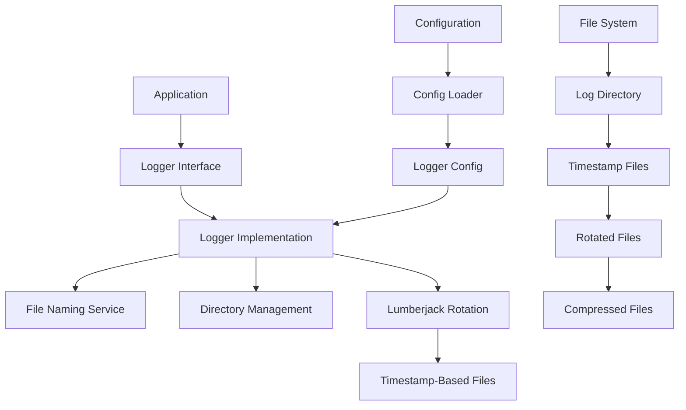
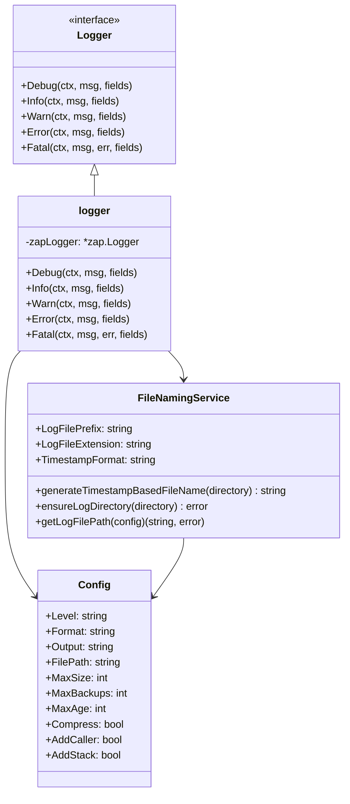
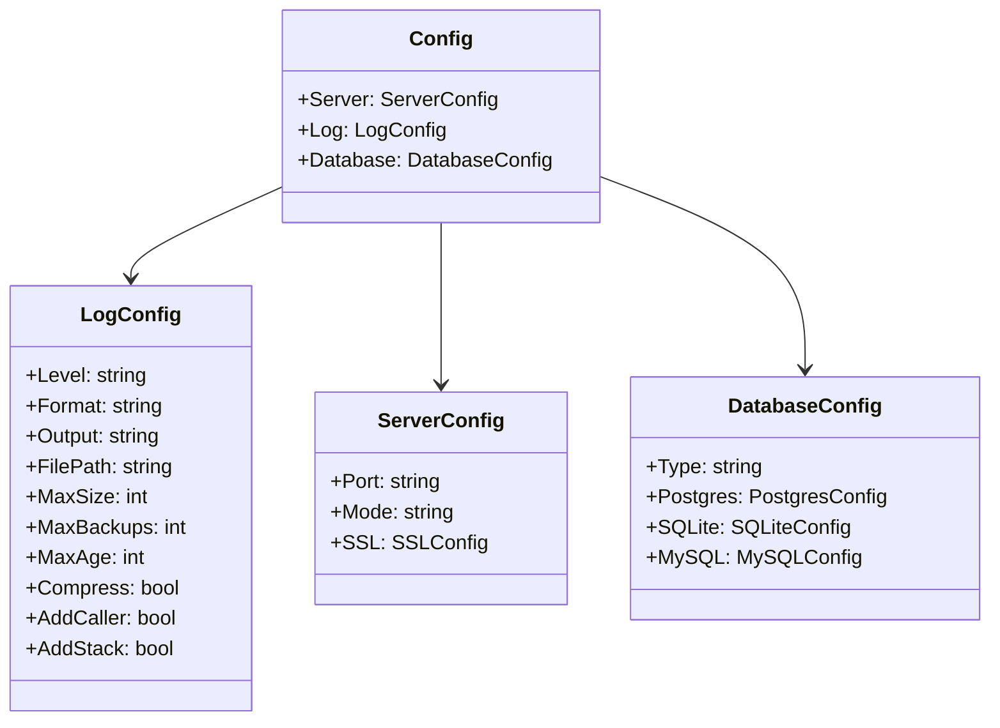
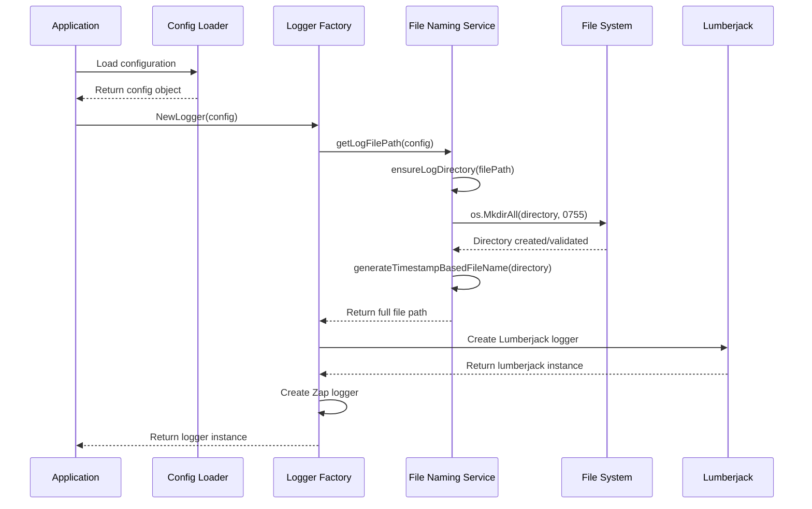
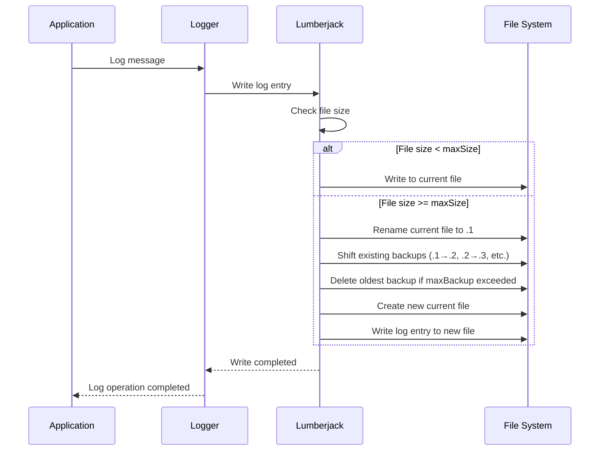
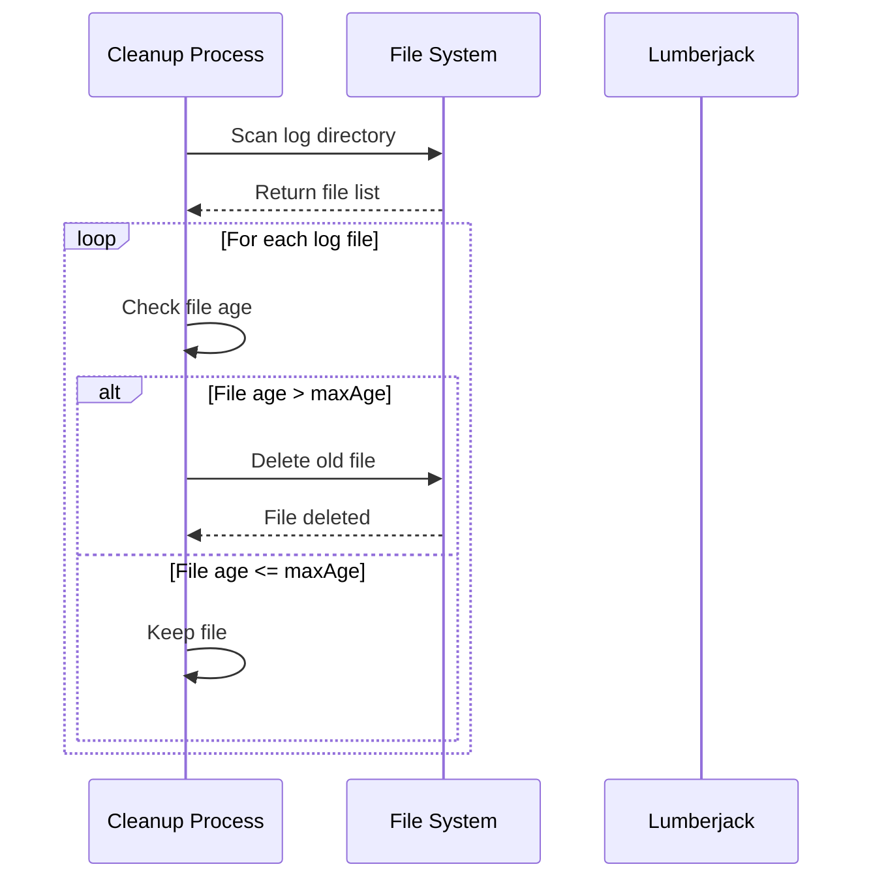
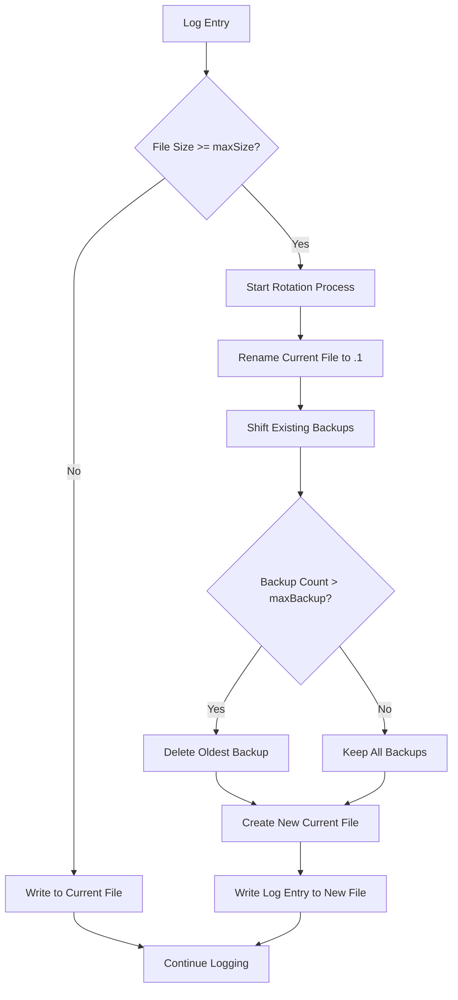

# 📝 **Timestamp-Based Logging System Design Document**

> **Version**: 2.0  
> **Date**: January 19, 2025  
> **Status**: Production Ready  
> **Architecture**: Timestamp-Based File Naming with Lumberjack Rotation  
> **Framework**: Uber Zap + Lumberjack + Custom Timestamp Logic

---

## 📋 **Table of Contents**

1. [System Overview](#system-overview)
2. [Architecture Design](#architecture-design)
3. [Class Diagrams](#class-diagrams)
4. [Sequence Diagrams](#sequence-diagrams)
5. [Configuration Management](#configuration-management)
6. [File Naming Strategy](#file-naming-strategy)
7. [Log Rotation Logic](#log-rotation-logic)
8. [Implementation Examples](#implementation-examples)
9. [Log File Examples](#log-file-examples)
10. [Migration Guide](#migration-guide)
11. [Production Considerations](#production-considerations)

---

## 🎯 **System Overview**

### **Core Principles**
- **Timestamp-Based Naming**: Files named with startup timestamp (YYYY-MM-DD_HH-MM-SS)
- **Automatic Directory Creation**: Creates log directories if they don't exist
- **Production-Ready Rotation**: Lumberjack-based log rotation and compression
- **Backward Compatibility**: Maintains existing configuration structure
- **High Performance**: Uber Zap for structured logging with minimal overhead

### **Key Features**
- ✅ **Constant Prefix**: Uses hardcoded "app" prefix for all log files
- ✅ **Automatic File Creation**: Creates timestamp-based files on logger initialization
- ✅ **Directory Management**: Automatically creates and manages log directories
- ✅ **Log Rotation**: Size-based rotation with configurable limits
- ✅ **Compression**: Automatic compression of rotated files
- ✅ **Error Handling**: Graceful fallback and error reporting

---

## 🏗️ **Architecture Design**

### **High-Level Architecture**



### **Component Responsibilities**

| Component | Responsibility |
|-----------|----------------|
| **Logger Interface** | Defines logging operations (Debug, Info, Warn, Error, Fatal) |
| **Logger Implementation** | Implements logging using Uber Zap |
| **File Naming Service** | Generates timestamp-based filenames |
| **Directory Management** | Creates and validates log directories |
| **Lumberjack Rotation** | Handles file rotation, compression, and cleanup |
| **Configuration** | Manages logger settings and file paths |

---

## 📊 **Class Diagrams**

### **Core Logger Classes**



### **Configuration Classes**



---

## 🔄 **Sequence Diagrams**

### **Logger Initialization Sequence**



### **Log Rotation Sequence**



### **File Cleanup Sequence (maxAge)**



---

## ⚙️ **Configuration Management**

### **Configuration Structure**

```yaml
# config.yaml
log:
  level: "info"         # Log level (debug, info, warn, error, fatal)
  format: "json"        # Log format (json, console)
  output: "file"        # Output destination (stdout, file)
  filePath: "./logs"    # Log directory path (NEW: Used for timestamp-based files)
  maxSize: 100          # Maximum log file size in MB
  maxBackup: 3          # Maximum number of backup files
  maxAge: 0             # Maximum age of log files in days (0 = disabled)
  compress: true        # Whether to compress old log files
  addCaller: true       # Whether to add caller information
  addStack: false       # Whether to add stack traces
```

### **Configuration Constants**

```go
// Constants for log file naming
const (
    LogFilePrefix = "app"                    // Constant prefix for all log files
    LogFileExtension = ".log"                // File extension for log files
    TimestampFormat = "2006-01-02_15-04-05" // Go time format for YYYY-MM-DD_HH-MM-SS
)
```

---

## 📁 **File Naming Strategy**

### **Naming Convention**

**Pattern**: `{prefix}_{YYYY-MM-DD_HH-MM-SS}.log`

**Examples**:
- `app_2025-01-19_14-30-25.log`
- `app_2025-01-19_09-15-30.log`
- `app_2025-01-20_16-45-12.log`

### **File Generation Logic**

```go
func generateTimestampBasedFileName(logDirectory string) string {
    timestamp := time.Now().Format(TimestampFormat)
    fileName := fmt.Sprintf("%s_%s%s", LogFilePrefix, timestamp, LogFileExtension)
    return filepath.Join(logDirectory, fileName)
}
```

### **Directory Structure**

```
./logs/
├── app_2025-01-19_14-30-25.log          # Current active file
├── app_2025-01-19_14-30-25.log.1.gz     # 1st rotation (compressed)
├── app_2025-01-19_14-30-25.log.2.gz     # 2nd rotation (compressed)
└── app_2025-01-19_14-30-25.log.3.gz     # 3rd rotation (compressed)
```

---

## 🔄 **Log Rotation Logic**

### **Rotation Triggers**

1. **Size-Based**: When current file reaches `maxSize` (MB)
2. **Time-Based**: Not implemented (uses size-based only)
3. **Manual**: Application restart creates new timestamp-based file

### **Rotation Process**



### **Backup File Management**

| Parameter | Purpose | Example |
|-----------|---------|---------|
| **maxSize** | File size before rotation | 100 MB |
| **maxBackup** | Number of backup files | 3 files |
| **maxAge** | Age limit for files | 0 days (disabled) |
| **compress** | Compress backup files | true |

---

## 💻 **Implementation Examples**

### **Basic Logger Usage**

```go
package main

import (
    "context"
    "tushartemplategin/pkg/logger"
)

func main() {
    // Create logger configuration
    config := &logger.Config{
        Level:      "info",
        Format:     "json",
        Output:     "file",
        FilePath:   "./logs",
        MaxSize:    100,
        MaxBackups: 3,
        MaxAge:     0,
        Compress:   true,
        AddCaller:  true,
        AddStack:   false,
    }
    
    // Initialize logger
    appLogger, err := logger.NewLogger(config)
    if err != nil {
        panic(err)
    }
    
    // Use logger
    ctx := context.Background()
    appLogger.Info(ctx, "Application started", map[string]interface{}{
        "version": "1.0.0",
        "build":   "timestamp-logging",
    })
}
```

### **Configuration Loading**

```go
// Load configuration from file
cfg, err := config.Load()
if err != nil {
    log.Fatalf("Failed to load configuration: %v", err)
}

// Create logger configuration
logConfig := &logger.Config{
    Level:      cfg.Log.Level,
    Format:     cfg.Log.Format,
    Output:     cfg.Log.Output,
    FilePath:   cfg.Log.FilePath,  // Now used as directory
    MaxSize:    cfg.Log.MaxSize,
    MaxBackups: cfg.Log.MaxBackups,
    MaxAge:     cfg.Log.MaxAge,
    Compress:   cfg.Log.Compress,
    AddCaller:  cfg.Log.AddCaller,
    AddStack:   cfg.Log.AddStack,
}

// Initialize logger
appLogger, err := logger.NewLogger(logConfig)
```

---

## 📄 **Log File Examples**

### **JSON Format Log Entry**

```json
{
  "level": "info",
  "ts": "2025-01-19T14:30:25.123Z",
  "caller": "main.go:45",
  "msg": "Application started",
  "version": "1.0.0",
  "build": "timestamp-logging",
  "timestamp": "2025-01-19T14:30:25.123Z"
}
```

### **Console Format Log Entry**

```
2025-01-19T14:30:25.123Z	INFO	main.go:45	Application started	{"version": "1.0.0", "build": "timestamp-logging"}
```

### **Error Log Entry**

```json
{
  "level": "error",
  "ts": "2025-01-19T14:30:25.123Z",
  "caller": "handler.go:78",
  "msg": "Database connection failed",
  "error": "connection timeout",
  "database": "postgres",
  "host": "localhost:5432",
  "timestamp": "2025-01-19T14:30:25.123Z"
}
```

### **File Rotation Example**

```
# Before rotation (100 MB reached)
./logs/app_2025-01-19_14-30-25.log (100 MB)

# After rotation
./logs/
├── app_2025-01-19_14-30-25.log (0 MB)      # New current file
└── app_2025-01-19_14-30-25.log.1.gz (100 MB) # Previous file compressed
```

---

## 🔄 **Migration Guide**

### **From Legacy to Timestamp-Based**

#### **Before (Legacy)**
```yaml
log:
  filePath: "/var/log/app/app.log"  # Full file path
```

#### **After (Timestamp-Based)**
```yaml
log:
  filePath: "/var/log/app"  # Directory path only
```

### **Migration Steps**

1. **Update Configuration**
   ```yaml
   # Change from full file path to directory path
   filePath: "./logs"  # Instead of "./logs/app.log"
   ```

2. **Deploy Application**
   - New timestamp-based files will be created
   - Old files remain unchanged

3. **Monitor New Files**
   ```bash
   # Check for new timestamp-based files
   ls -la ./logs/
   # Should see: app_YYYY-MM-DD_HH-MM-SS.log
   ```

4. **Cleanup Old Files** (Optional)
   ```bash
   # Remove old non-timestamp files after verification
   rm ./logs/app.log*
   ```

---

## 🚀 **Production Considerations**

### **Performance Optimizations**

1. **Buffered Writing**: Lumberjack handles buffering automatically
2. **Compression**: Reduces disk space usage by ~70%
3. **Async Logging**: Consider for high-throughput applications

### **Monitoring and Alerting**

```bash
# Monitor log directory size
du -sh ./logs/

# Count log files
ls -la ./logs/ | wc -l

# Check for errors
grep -r "ERROR" ./logs/

# Monitor disk space
df -h ./logs/
```

### **Backup and Recovery**

```bash
# Backup log directory
tar -czf logs_backup_$(date +%Y%m%d).tar.gz ./logs/

# Restore logs
tar -xzf logs_backup_20250119.tar.gz
```

### **Security Considerations**

1. **File Permissions**: Log files created with 644 permissions
2. **Directory Permissions**: Log directories created with 755 permissions
3. **Access Control**: Ensure proper user/group ownership

---

## 📊 **Configuration Examples by Use Case**

### **Development Environment**
```yaml
log:
  level: "debug"
  format: "console"
  output: "file"
  filePath: "./logs"
  maxSize: 10
  maxBackup: 2
  maxAge: 1
  compress: false
  addCaller: true
  addStack: true
```

### **Production Environment**
```yaml
log:
  level: "info"
  format: "json"
  output: "file"
  filePath: "/var/log/app"
  maxSize: 100
  maxBackup: 5
  maxAge: 30
  compress: true
  addCaller: true
  addStack: false
```

### **High-Traffic Environment**
```yaml
log:
  level: "warn"
  format: "json"
  output: "file"
  filePath: "/var/log/app"
  maxSize: 500
  maxBackup: 10
  maxAge: 7
  compress: true
  addCaller: false
  addStack: false
```

---

## ✅ **Summary**

The timestamp-based logging system provides:

- **Automatic File Management**: Creates timestamp-based files automatically
- **Production-Ready Rotation**: Handles file rotation, compression, and cleanup
- **Backward Compatibility**: Works with existing configuration structure
- **High Performance**: Uses Uber Zap for efficient logging
- **Flexible Configuration**: Supports various deployment scenarios

This design ensures reliable, maintainable, and scalable logging for production applications while providing clear audit trails and debugging capabilities.

---

**Document Version**: 2.0  
**Last Updated**: January 19, 2025  
**Status**: Production Ready ✅
