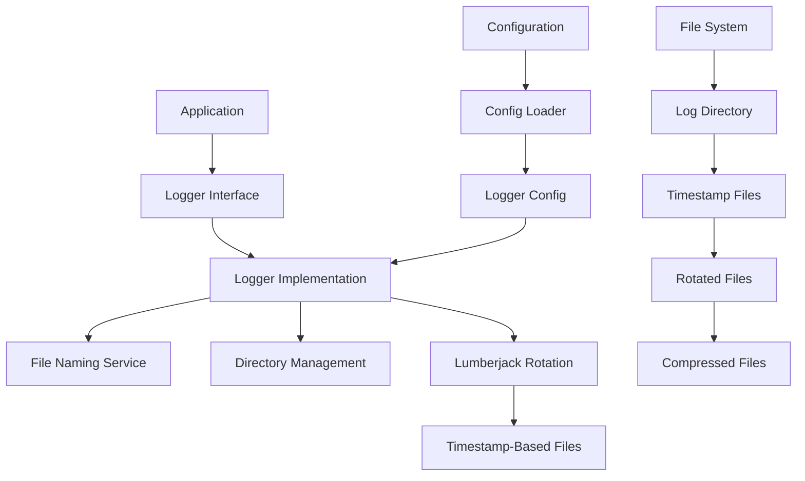
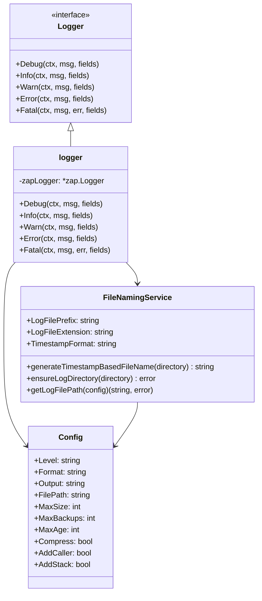
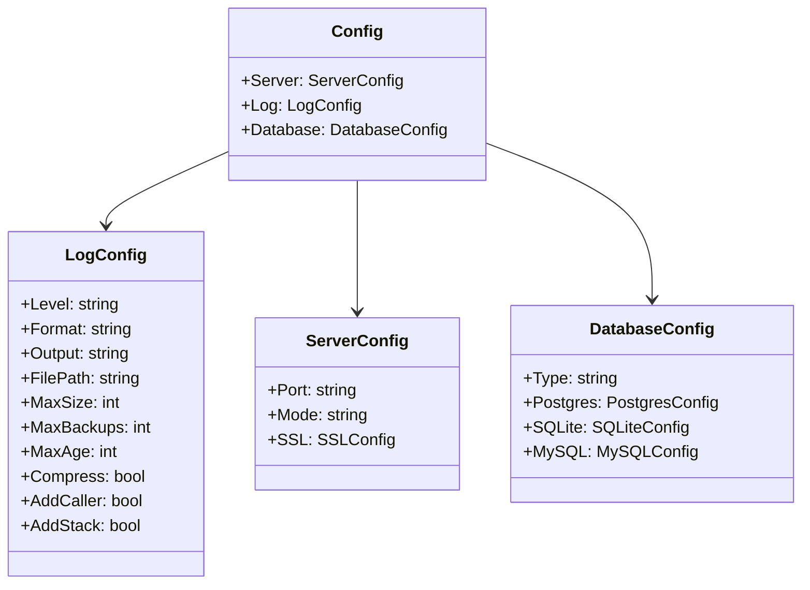
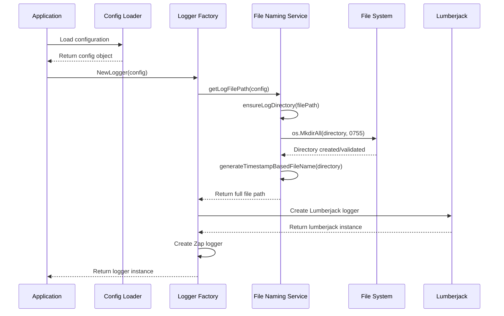
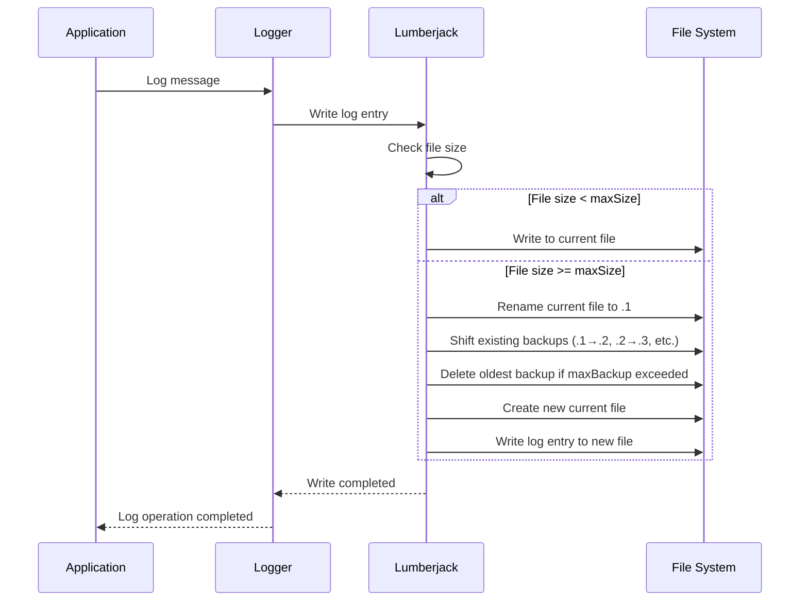
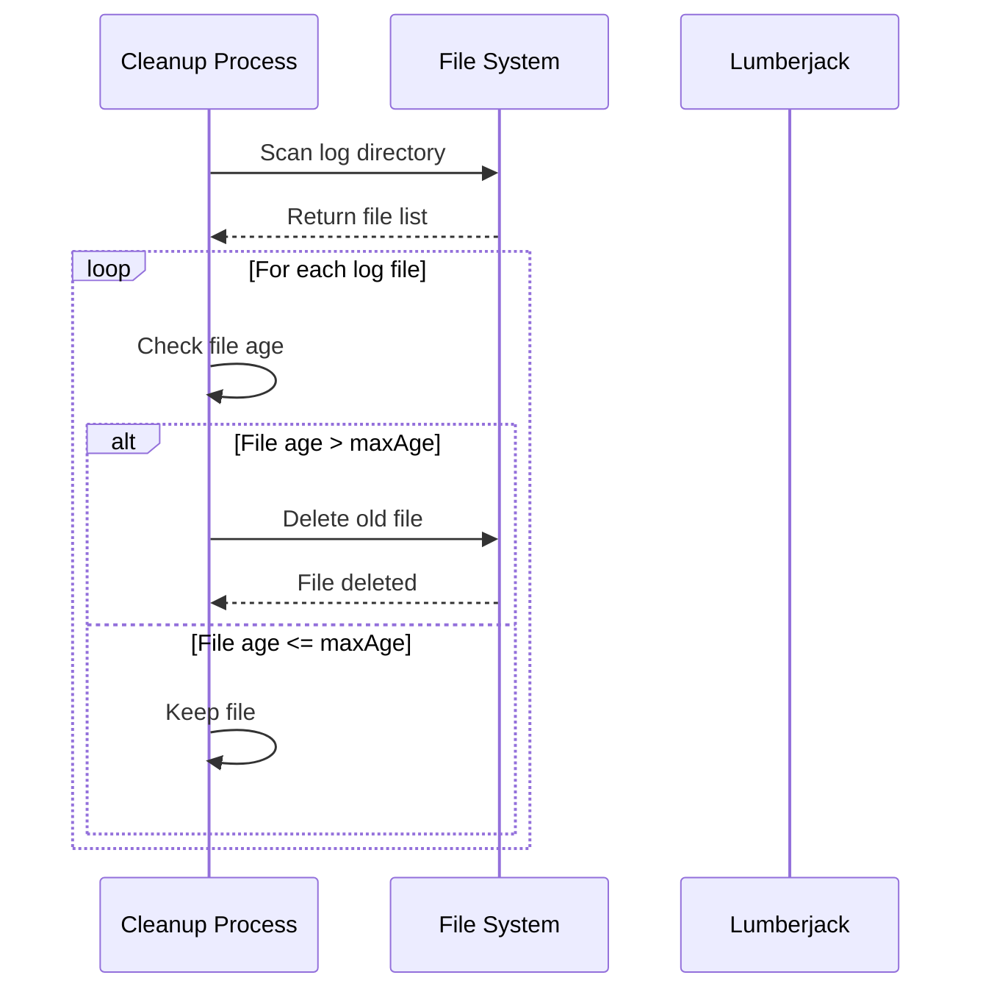
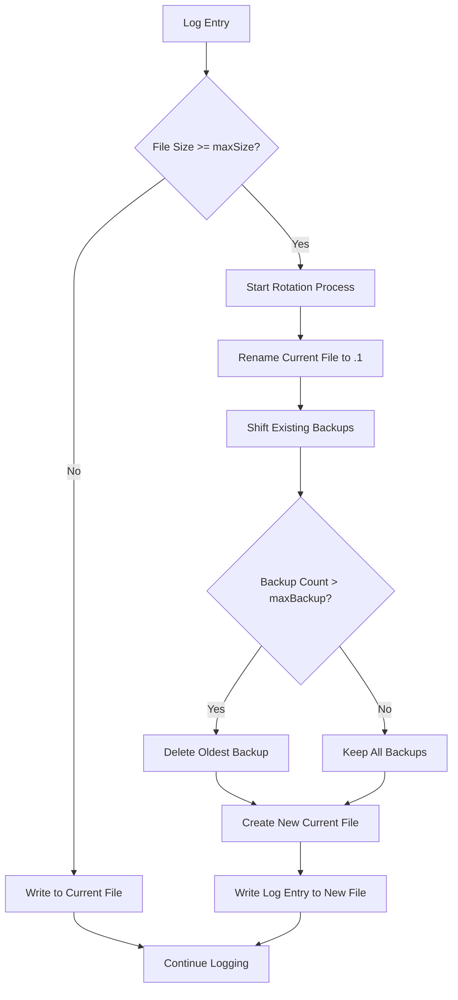

# 📝 **Timestamp-Based Logging System Design Document**

> **Version**: 2.0  
> **Date**: January 19, 2025  
> **Status**: Production Ready  
> **Architecture**: Timestamp-Based File Naming with Lumberjack Rotation  
> **Framework**: Uber Zap + Lumberjack + Custom Timestamp Logic

---

## 📋 **Table of Contents**

1. [System Overview](#system-overview)
2. [Architecture Design](#architecture-design)
3. [Class Diagrams](#class-diagrams)
4. [Sequence Diagrams](#sequence-diagrams)
5. [Configuration Management](#configuration-management)
6. [File Naming Strategy](#file-naming-strategy)
7. [Log Rotation Logic](#log-rotation-logic)
8. [Implementation Examples](#implementation-examples)
9. [Log File Examples](#log-file-examples)
10. [Migration Guide](#migration-guide)
11. [Production Considerations](#production-considerations)

---

## 🎯 **System Overview**

### **What is Timestamp-Based Logging?**

Timestamp-based logging is an advanced logging strategy that automatically generates log files with timestamps embedded in their filenames. Unlike traditional logging where you specify a fixed filename, this system creates files with names like `app_2025-01-19_14-30-25.log`, where the timestamp represents when the application started.

### **Why Timestamp-Based Logging?**

**Traditional Approach Problems:**
- Fixed filenames make it hard to identify when logs were created
- Multiple application instances can overwrite each other's logs
- Difficult to correlate logs with specific application runs
- No clear chronological organization

**Timestamp-Based Benefits:**
- **Clear Chronology**: Instantly know when the application started
- **Instance Isolation**: Each application run gets its own log files
- **Easy Correlation**: Match logs with specific deployments or runs
- **Better Organization**: Natural chronological sorting of log files
- **Debugging Aid**: Quickly identify logs from specific time periods

### **Core Principles**

#### **1. Timestamp-Based Naming**
The system generates filenames using the pattern `{prefix}_{YYYY-MM-DD_HH-MM-SS}.log`. The timestamp is captured **once** when the logger is initialized, not on each log entry. This ensures all log files from a single application run share the same base timestamp.

**Example**: If your application starts at 2:30:25 PM on January 19, 2025, all log files will be named:
- `app_2025-01-19_14-30-25.log` (current file)
- `app_2025-01-19_14-30-25.log.1.gz` (first rotation)
- `app_2025-01-19_14-30-25.log.2.gz` (second rotation)

#### **2. Automatic Directory Creation**
The system automatically creates log directories if they don't exist, eliminating the need for manual directory setup. This includes:
- Creating parent directories recursively
- Setting appropriate permissions (755 for directories)
- Validating directory paths
- Graceful error handling if directory creation fails

#### **3. Production-Ready Rotation**
Built on Lumberjack, a battle-tested Go library for log rotation, providing:
- **Size-based rotation**: Files rotate when they reach a specified size
- **Automatic compression**: Old files are compressed to save disk space
- **Configurable retention**: Control how many backup files to keep
- **Age-based cleanup**: Optional deletion of files older than specified days
- **Thread-safe operations**: Safe for concurrent logging

#### **4. Backward Compatibility**
The system maintains full compatibility with existing configurations:
- Uses the same `filePath` configuration field
- No breaking changes to existing code
- Gradual migration path from legacy logging
- Same configuration file formats (YAML/JSON)

#### **5. High Performance**
Leverages Uber Zap, one of the fastest Go logging libraries:
- **Structured logging**: JSON and console formats
- **Minimal allocation**: Optimized for performance
- **Concurrent safe**: Multiple goroutines can log simultaneously
- **Configurable levels**: Debug, Info, Warn, Error, Fatal

### **Key Features**

#### **✅ Constant Prefix**
All log files use a hardcoded "app" prefix, ensuring consistency across the application. This prefix is defined as a constant in the code, making it easy to identify application logs and maintain consistency.

#### **✅ Automatic File Creation**
Log files are created automatically when the logger is initialized. No manual file creation or management is required. The system handles:
- Generating timestamp-based filenames
- Creating the log directory if needed
- Initializing the log file with proper permissions
- Setting up rotation parameters

#### **✅ Directory Management**
The system provides comprehensive directory management:
- **Automatic Creation**: Creates directories if they don't exist
- **Permission Setting**: Sets appropriate permissions (755 for directories, 644 for files)
- **Path Validation**: Validates directory paths and handles errors gracefully
- **Cross-Platform**: Works on Windows, Linux, and macOS

#### **✅ Log Rotation**
Advanced log rotation capabilities:
- **Size-based rotation**: Files rotate when they reach the configured size limit
- **Backup management**: Keeps a configurable number of backup files
- **Age-based cleanup**: Optional deletion of files older than specified days
- **Compression**: Automatic compression of rotated files to save space
- **Atomic operations**: Safe rotation without data loss

#### **✅ Error Handling**
Robust error handling throughout the system:
- **Graceful fallback**: Falls back to stdout if file operations fail
- **Detailed error messages**: Clear error reporting for troubleshooting
- **Validation**: Validates configuration parameters before use
- **Recovery**: Automatic recovery from temporary failures

---

## 🏗️ **Architecture Design**

### **High-Level Architecture**



### **Component Responsibilities**

| Component | Responsibility |
|-----------|----------------|
| **Logger Interface** | Defines logging operations (Debug, Info, Warn, Error, Fatal) |
| **Logger Implementation** | Implements logging using Uber Zap |
| **File Naming Service** | Generates timestamp-based filenames |
| **Directory Management** | Creates and validates log directories |
| **Lumberjack Rotation** | Handles file rotation, compression, and cleanup |
| **Configuration** | Manages logger settings and file paths |

---

## 📊 **Class Diagrams**

### **Core Logger Classes**



### **Configuration Classes**



---

## 🔄 **Sequence Diagrams**

### **Logger Initialization Sequence**



### **Log Rotation Sequence**



### **File Cleanup Sequence (maxAge)**



---

## ⚙️ **Configuration Management**

### **Configuration Overview**

The logging system uses a comprehensive configuration structure that allows fine-tuning of all aspects of the logging behavior. The configuration is loaded from YAML or JSON files and supports both development and production environments with different settings.

### **Configuration Structure**

The logging configuration is part of the main application configuration and includes the following parameters:

```yaml
# config.yaml
log:
  level: "info"         # Log level (debug, info, warn, error, fatal)
  format: "json"        # Log format (json, console)
  output: "file"        # Output destination (stdout, file)
  filePath: "./logs"    # Log directory path (NEW: Used for timestamp-based files)
  maxSize: 100          # Maximum log file size in MB
  maxBackup: 3          # Maximum number of backup files
  maxAge: 0             # Maximum age of log files in days (0 = disabled)
  compress: true        # Whether to compress old log files
  addCaller: true       # Whether to add caller information
  addStack: false       # Whether to add stack traces
```

### **Configuration Parameters Explained**

#### **Log Level (`level`)**
Controls which log messages are written. The levels are hierarchical, meaning setting a level includes all higher levels.

**Available Levels:**
- **`debug`**: Most verbose level, includes all messages
- **`info`**: General information messages (default for production)
- **`warn`**: Warning messages that don't stop execution
- **`error`**: Error messages that indicate problems
- **`fatal`**: Fatal errors that cause the application to exit

**Example Usage:**
```yaml
level: "info"  # Will log info, warn, error, and fatal messages
level: "debug" # Will log all messages including debug
level: "error" # Will only log error and fatal messages
```

#### **Log Format (`format`)**
Determines the output format of log messages.

**Available Formats:**
- **`json`**: Structured JSON format, ideal for log aggregation systems
- **`console`**: Human-readable format, ideal for development

**JSON Format Example:**
```json
{
  "level": "info",
  "ts": "2025-01-19T14:30:25.123Z",
  "caller": "main.go:45",
  "msg": "Application started",
  "version": "1.0.0"
}
```

**Console Format Example:**
```
2025-01-19T14:30:25.123Z	INFO	main.go:45	Application started	{"version": "1.0.0"}
```

#### **Output Destination (`output`)**
Controls where log messages are written.

**Available Options:**
- **`stdout`**: Write to standard output (console)
- **`file`**: Write to timestamp-based log files

**Use Cases:**
- **Development**: Use `stdout` for immediate feedback
- **Production**: Use `file` for persistent logging
- **Docker**: Use `stdout` for container log collection
- **Kubernetes**: Use `stdout` for pod log collection

#### **File Path (`filePath`)**
**NEW BEHAVIOR**: This parameter now specifies the **directory** where timestamp-based log files will be created, not a specific file path.

**Examples:**
```yaml
filePath: "./logs"           # Relative path (creates ./logs/ directory)
filePath: "/var/log/app"     # Absolute path (creates /var/log/app/ directory)
filePath: "logs"             # Simple directory name (creates logs/ directory)
```

**What Happens:**
1. System checks if directory exists
2. Creates directory if it doesn't exist (with 755 permissions)
3. Generates timestamp-based filename within that directory
4. Creates log file with generated filename

#### **Maximum File Size (`maxSize`)**
Controls when log files are rotated based on size.

**Unit**: Megabytes (MB)
**Default**: 100 MB
**Range**: Any positive integer

**Examples:**
```yaml
maxSize: 10    # Rotate when file reaches 10 MB
maxSize: 100   # Rotate when file reaches 100 MB (default)
maxSize: 500   # Rotate when file reaches 500 MB
```

**Considerations:**
- **Smaller files**: More frequent rotations, easier to handle
- **Larger files**: Fewer rotations, better performance
- **Production**: 100-200 MB is typically optimal
- **Development**: 10-50 MB for easier debugging

#### **Maximum Backups (`maxBackup`)**
Controls how many rotated log files to keep.

**Default**: 3
**Range**: 0 (unlimited) to any positive integer

**Examples:**
```yaml
maxBackup: 0   # Keep all backup files (unlimited)
maxBackup: 3   # Keep 3 backup files (default)
maxBackup: 10  # Keep 10 backup files
```

**Storage Impact:**
- **maxBackup: 3** with **maxSize: 100** = ~400 MB maximum storage
- **maxBackup: 10** with **maxSize: 100** = ~1.1 GB maximum storage

#### **Maximum Age (`maxAge`)**
Controls how long to keep log files based on age.

**Unit**: Days
**Default**: 0 (disabled)
**Range**: 0 (disabled) to any positive integer

**Examples:**
```yaml
maxAge: 0    # No age limit (keep files indefinitely)
maxAge: 7    # Delete files older than 7 days
maxAge: 30   # Delete files older than 30 days
```

**Use Cases:**
- **Development**: 1-3 days for quick cleanup
- **Production**: 7-30 days for analysis
- **Compliance**: 90+ days for regulatory requirements
- **Debugging**: 0 (disabled) for long-term retention

#### **Compression (`compress`)**
Controls whether rotated log files are compressed.

**Default**: true
**Options**: true, false

**Benefits of Compression:**
- **Space Savings**: Typically 70-80% reduction in file size
- **Faster Transfers**: Smaller files for backup and transfer
- **Cost Reduction**: Lower storage costs

**Trade-offs:**
- **CPU Usage**: Slight increase in CPU usage during rotation
- **Access Time**: Requires decompression to read old logs

#### **Caller Information (`addCaller`)**
Controls whether to include caller information in log messages.

**Default**: true
**Options**: true, false

**What It Adds:**
- **File Name**: Source file where log was called
- **Line Number**: Line number where log was called
- **Function Name**: Function where log was called

**Example:**
```json
{
  "level": "info",
  "caller": "main.go:45",  // Added by addCaller: true
  "msg": "Application started"
}
```

#### **Stack Traces (`addStack`)**
Controls whether to include stack traces in error logs.

**Default**: false
**Options**: true, false

**When to Enable:**
- **Development**: true for detailed debugging
- **Production**: false for performance
- **Error Analysis**: true for complex error investigation

### **Configuration Constants**

The system uses several constants that are defined in the code and cannot be changed through configuration:

```go
// Constants for log file naming
const (
    LogFilePrefix = "app"                    // Constant prefix for all log files
    LogFileExtension = ".log"                // File extension for log files
    TimestampFormat = "2006-01-02_15-04-05" // Go time format for YYYY-MM-DD_HH-MM-SS
)
```

**Why Constants:**
- **Consistency**: Ensures all log files follow the same naming pattern
- **Simplicity**: No need to configure basic naming rules
- **Maintainability**: Easy to change naming convention in one place
- **Performance**: No runtime configuration lookup for basic settings

### **Configuration Loading Process**

1. **File Detection**: System looks for `config.yaml` or `config.json`
2. **Parsing**: Configuration is parsed using Viper library
3. **Validation**: Parameters are validated for correctness
4. **Defaults**: Missing parameters are filled with default values
5. **Logger Creation**: Logger is created with validated configuration

### **Environment-Specific Configurations**

#### **Development Environment**
```yaml
log:
  level: "debug"      # Verbose logging
  format: "console"   # Human-readable format
  output: "stdout"    # Console output
  filePath: "./logs"  # Local directory
  maxSize: 10         # Small files for easy handling
  maxBackup: 2        # Few backups
  maxAge: 1           # Quick cleanup
  compress: false     # No compression for easy reading
  addCaller: true     # Include caller info
  addStack: true      # Include stack traces
```

#### **Production Environment**
```yaml
log:
  level: "info"       # Standard logging
  format: "json"      # Structured format
  output: "file"      # File output
  filePath: "/var/log/app"  # System directory
  maxSize: 100        # Standard file size
  maxBackup: 5        # More backups
  maxAge: 30          # Longer retention
  compress: true      # Compress for space
  addCaller: true     # Include caller info
  addStack: false     # No stack traces for performance
```

#### **High-Traffic Environment**
```yaml
log:
  level: "warn"       # Minimal logging
  format: "json"      # Structured format
  output: "file"      # File output
  filePath: "/var/log/app"  # System directory
  maxSize: 500        # Large files
  maxBackup: 10       # Many backups
  maxAge: 7           # Short retention
  compress: true      # Compress for space
  addCaller: false    # No caller info for performance
  addStack: false     # No stack traces for performance
```

---

## 📁 **File Naming Strategy**

### **Naming Convention Overview**

The timestamp-based file naming strategy creates log files with embedded timestamps that represent when the application started. This approach provides several advantages over traditional fixed-filename logging:

**Benefits:**
- **Chronological Organization**: Files are naturally sorted by creation time
- **Instance Isolation**: Each application run gets unique log files
- **Easy Correlation**: Match logs with specific deployments or runs
- **Debugging Aid**: Quickly identify logs from specific time periods
- **No Conflicts**: Multiple instances can run without overwriting logs

### **Naming Pattern**

**Pattern**: `{prefix}_{YYYY-MM-DD_HH-MM-SS}.log`

**Components:**
- **`{prefix}`**: Constant prefix (hardcoded as "app")
- **`{YYYY-MM-DD_HH-MM-SS}`**: Timestamp when logger was initialized
- **`.log`**: File extension

**Examples**:
- `app_2025-01-19_14-30-25.log` (Started at 2:30:25 PM on Jan 19, 2025)
- `app_2025-01-19_09-15-30.log` (Started at 9:15:30 AM on Jan 19, 2025)
- `app_2025-01-20_16-45-12.log` (Started at 4:45:12 PM on Jan 20, 2025)

### **Timestamp Format Details**

The timestamp uses Go's time format specification: `2006-01-02_15-04-05`

**Format Breakdown:**
- **`2006`**: Year (4 digits)
- **`01`**: Month (2 digits, zero-padded)
- **`02`**: Day (2 digits, zero-padded)
- **`_`**: Separator between date and time
- **`15`**: Hour (24-hour format, 2 digits, zero-padded)
- **`04`**: Minute (2 digits, zero-padded)
- **`05`**: Second (2 digits, zero-padded)

**Why This Format:**
- **Sortable**: Files sort chronologically by name
- **Readable**: Easy to understand at a glance
- **Unique**: Precise to the second, avoiding conflicts
- **Cross-Platform**: Works on all operating systems

### **File Generation Logic**

The file naming is handled by the `generateTimestampBasedFileName` function:

```go
func generateTimestampBasedFileName(logDirectory string) string {
    timestamp := time.Now().Format(TimestampFormat)
    fileName := fmt.Sprintf("%s_%s%s", LogFilePrefix, timestamp, LogFileExtension)
    return filepath.Join(logDirectory, fileName)
}
```

**Process:**
1. **Get Current Time**: `time.Now()` gets the current timestamp
2. **Format Timestamp**: Convert to string using `TimestampFormat`
3. **Build Filename**: Combine prefix, timestamp, and extension
4. **Join Path**: Combine with directory path using `filepath.Join`

**Example Execution:**
```go
// If called at 2025-01-19 14:30:25
timestamp := "2025-01-19_14-30-25"
fileName := "app_2025-01-19_14-30-25.log"
fullPath := "./logs/app_2025-01-19_14-30-25.log"
```

### **When Timestamps Are Generated**

**Important**: The timestamp is generated **once** when the logger is initialized, not on each log entry. This ensures:

- **Consistency**: All log files from one application run share the same timestamp
- **Organization**: Related logs are grouped together
- **Performance**: No timestamp generation overhead on each log entry

**Timeline Example:**
```
9:00:00 AM  - Application starts, logger initialized
            - Timestamp generated: "2025-01-19_09-00-00"
            - File created: app_2025-01-19_09-00-00.log

9:00:01 AM  - First log entry written
            - Written to: app_2025-01-19_09-00-00.log

10:00:00 AM - File rotation occurs (100 MB reached)
            - Current file renamed to: app_2025-01-19_09-00-00.log.1.gz
            - New file created: app_2025-01-19_09-00-00.log

11:00:00 AM - Another log entry written
            - Written to: app_2025-01-19_09-00-00.log (same base name)
```

### **Directory Structure**

The system creates a hierarchical directory structure for organized log management:

```
./logs/                                    # Log directory (configurable)
├── app_2025-01-19_14-30-25.log          # Current active file
├── app_2025-01-19_14-30-25.log.1.gz     # 1st rotation (compressed)
├── app_2025-01-19_14-30-25.log.2.gz     # 2nd rotation (compressed)
└── app_2025-01-19_14-30-25.log.3.gz     # 3rd rotation (compressed)
```

**File Types:**
- **`.log`**: Current active file (uncompressed)
- **`.log.N.gz`**: Rotated files (compressed)
- **`.log.N`**: Rotated files (uncompressed, if compression disabled)

### **File Naming During Rotation**

When log files are rotated, the naming follows a specific pattern:

**Before Rotation:**
```
app_2025-01-19_14-30-25.log (100 MB)     # Current file
```

**After Rotation:**
```
app_2025-01-19_14-30-25.log (0 MB)       # New current file
app_2025-01-19_14-30-25.log.1.gz (100 MB) # Previous file compressed
```

**Multiple Rotations:**
```
app_2025-01-19_14-30-25.log (0 MB)       # Current file
app_2025-01-19_14-30-25.log.1.gz (100 MB) # Most recent rotation
app_2025-01-19_14-30-25.log.2.gz (100 MB) # Second most recent
app_2025-01-19_14-30-25.log.3.gz (100 MB) # Third most recent
```

### **Cross-Platform Compatibility**

The file naming strategy is designed to work across all platforms:

**Windows:**
- Uses backslashes in paths: `logs\app_2025-01-19_14-30-25.log`
- Handles Windows-specific path separators
- Compatible with Windows file naming conventions

**Linux/macOS:**
- Uses forward slashes in paths: `logs/app_2025-01-19_14-30-25.log`
- Follows Unix file naming conventions
- Supports symbolic links and permissions

**Docker/Containers:**
- Works within container filesystems
- Compatible with volume mounts
- Supports log collection systems

### **File Naming Best Practices**

**Do:**
- Use descriptive directory names: `./logs`, `/var/log/app`
- Keep timestamps in filename for easy identification
- Use consistent naming patterns across environments
- Consider timezone implications for distributed systems

**Don't:**
- Use spaces or special characters in filenames
- Change naming pattern after deployment
- Use relative paths in production (use absolute paths)
- Forget about timezone consistency in distributed systems

### **Integration with Log Collection Systems**

The timestamp-based naming works well with various log collection systems:

**ELK Stack (Elasticsearch, Logstash, Kibana):**
- Files can be easily identified by timestamp
- Logstash can parse timestamps from filenames
- Kibana can create time-based visualizations

**Fluentd:**
- Can use filename patterns for log routing
- Timestamps help with log ordering
- Easy to configure file monitoring

**Splunk:**
- Can index files based on timestamp patterns
- Supports time-based log analysis
- Easy correlation with application events

**Custom Scripts:**
- Simple to parse timestamps from filenames
- Easy to implement log rotation policies
- Straightforward backup and archival strategies

---

## 🔄 **Log Rotation Logic**

### **Rotation Triggers**

1. **Size-Based**: When current file reaches `maxSize` (MB)
2. **Time-Based**: Not implemented (uses size-based only)
3. **Manual**: Application restart creates new timestamp-based file

### **Rotation Process**



### **Backup File Management**

| Parameter | Purpose | Example |
|-----------|---------|---------|
| **maxSize** | File size before rotation | 100 MB |
| **maxBackup** | Number of backup files | 3 files |
| **maxAge** | Age limit for files | 0 days (disabled) |
| **compress** | Compress backup files | true |

---

## 💻 **Implementation Examples**

### **Basic Logger Usage**

```go
package main

import (
    "context"
    "tushartemplategin/pkg/logger"
)

func main() {
    // Create logger configuration
    config := &logger.Config{
        Level:      "info",
        Format:     "json",
        Output:     "file",
        FilePath:   "./logs",
        MaxSize:    100,
        MaxBackups: 3,
        MaxAge:     0,
        Compress:   true,
        AddCaller:  true,
        AddStack:   false,
    }
    
    // Initialize logger
    appLogger, err := logger.NewLogger(config)
    if err != nil {
        panic(err)
    }
    
    // Use logger
    ctx := context.Background()
    appLogger.Info(ctx, "Application started", map[string]interface{}{
        "version": "1.0.0",
        "build":   "timestamp-logging",
    })
}
```

### **Configuration Loading**

```go
// Load configuration from file
cfg, err := config.Load()
if err != nil {
    log.Fatalf("Failed to load configuration: %v", err)
}

// Create logger configuration
logConfig := &logger.Config{
    Level:      cfg.Log.Level,
    Format:     cfg.Log.Format,
    Output:     cfg.Log.Output,
    FilePath:   cfg.Log.FilePath,  // Now used as directory
    MaxSize:    cfg.Log.MaxSize,
    MaxBackups: cfg.Log.MaxBackups,
    MaxAge:     cfg.Log.MaxAge,
    Compress:   cfg.Log.Compress,
    AddCaller:  cfg.Log.AddCaller,
    AddStack:   cfg.Log.AddStack,
}

// Initialize logger
appLogger, err := logger.NewLogger(logConfig)
```

---

## 📄 **Log File Examples**

### **JSON Format Log Entry**

```json
{
  "level": "info",
  "ts": "2025-01-19T14:30:25.123Z",
  "caller": "main.go:45",
  "msg": "Application started",
  "version": "1.0.0",
  "build": "timestamp-logging",
  "timestamp": "2025-01-19T14:30:25.123Z"
}
```

### **Console Format Log Entry**

```
2025-01-19T14:30:25.123Z	INFO	main.go:45	Application started	{"version": "1.0.0", "build": "timestamp-logging"}
```

### **Error Log Entry**

```json
{
  "level": "error",
  "ts": "2025-01-19T14:30:25.123Z",
  "caller": "handler.go:78",
  "msg": "Database connection failed",
  "error": "connection timeout",
  "database": "postgres",
  "host": "localhost:5432",
  "timestamp": "2025-01-19T14:30:25.123Z"
}
```

### **File Rotation Example**

```
# Before rotation (100 MB reached)
./logs/app_2025-01-19_14-30-25.log (100 MB)

# After rotation
./logs/
├── app_2025-01-19_14-30-25.log (0 MB)      # New current file
└── app_2025-01-19_14-30-25.log.1.gz (100 MB) # Previous file compressed
```

---

## 🔄 **Migration Guide**

### **From Legacy to Timestamp-Based**

#### **Before (Legacy)**
```yaml
log:
  filePath: "/var/log/app/app.log"  # Full file path
```

#### **After (Timestamp-Based)**
```yaml
log:
  filePath: "/var/log/app"  # Directory path only
```

### **Migration Steps**

1. **Update Configuration**
   ```yaml
   # Change from full file path to directory path
   filePath: "./logs"  # Instead of "./logs/app.log"
   ```

2. **Deploy Application**
   - New timestamp-based files will be created
   - Old files remain unchanged

3. **Monitor New Files**
   ```bash
   # Check for new timestamp-based files
   ls -la ./logs/
   # Should see: app_YYYY-MM-DD_HH-MM-SS.log
   ```

4. **Cleanup Old Files** (Optional)
   ```bash
   # Remove old non-timestamp files after verification
   rm ./logs/app.log*
   ```

---

## 🚀 **Production Considerations**

### **Performance Optimizations**

1. **Buffered Writing**: Lumberjack handles buffering automatically
2. **Compression**: Reduces disk space usage by ~70%
3. **Async Logging**: Consider for high-throughput applications

### **Monitoring and Alerting**

```bash
# Monitor log directory size
du -sh ./logs/

# Count log files
ls -la ./logs/ | wc -l

# Check for errors
grep -r "ERROR" ./logs/

# Monitor disk space
df -h ./logs/
```

### **Backup and Recovery**

```bash
# Backup log directory
tar -czf logs_backup_$(date +%Y%m%d).tar.gz ./logs/

# Restore logs
tar -xzf logs_backup_20250119.tar.gz
```

### **Security Considerations**

1. **File Permissions**: Log files created with 644 permissions
2. **Directory Permissions**: Log directories created with 755 permissions
3. **Access Control**: Ensure proper user/group ownership

---

## 📊 **Configuration Examples by Use Case**

### **Development Environment**
```yaml
log:
  level: "debug"
  format: "console"
  output: "file"
  filePath: "./logs"
  maxSize: 10
  maxBackup: 2
  maxAge: 1
  compress: false
  addCaller: true
  addStack: true
```

### **Production Environment**
```yaml
log:
  level: "info"
  format: "json"
  output: "file"
  filePath: "/var/log/app"
  maxSize: 100
  maxBackup: 5
  maxAge: 30
  compress: true
  addCaller: true
  addStack: false
```

### **High-Traffic Environment**
```yaml
log:
  level: "warn"
  format: "json"
  output: "file"
  filePath: "/var/log/app"
  maxSize: 500
  maxBackup: 10
  maxAge: 7
  compress: true
  addCaller: false
  addStack: false
```

---

## ✅ **Summary**

The timestamp-based logging system provides:

- **Automatic File Management**: Creates timestamp-based files automatically
- **Production-Ready Rotation**: Handles file rotation, compression, and cleanup
- **Backward Compatibility**: Works with existing configuration structure
- **High Performance**: Uses Uber Zap for efficient logging
- **Flexible Configuration**: Supports various deployment scenarios

This design ensures reliable, maintainable, and scalable logging for production applications while providing clear audit trails and debugging capabilities.

---

**Document Version**: 2.0  
**Last Updated**: January 19, 2025  
**Status**: Production Ready ✅
