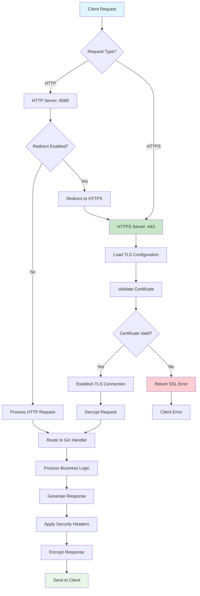
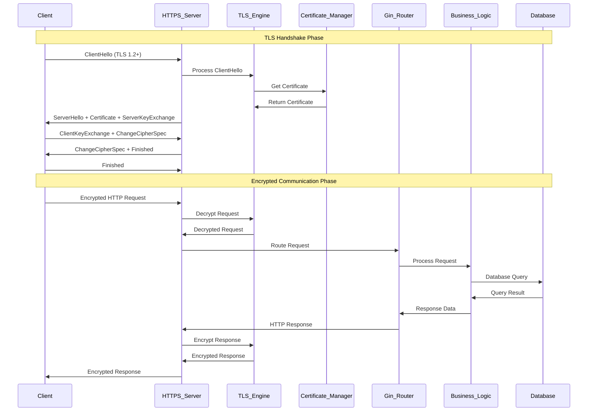
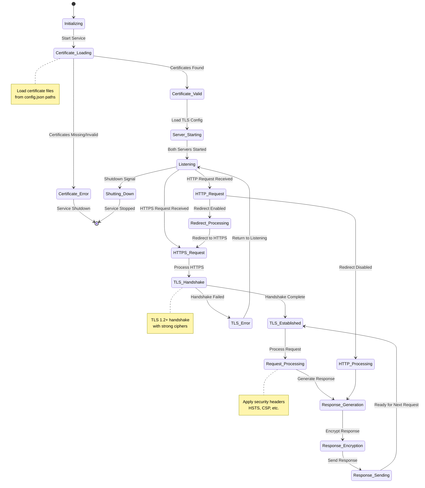
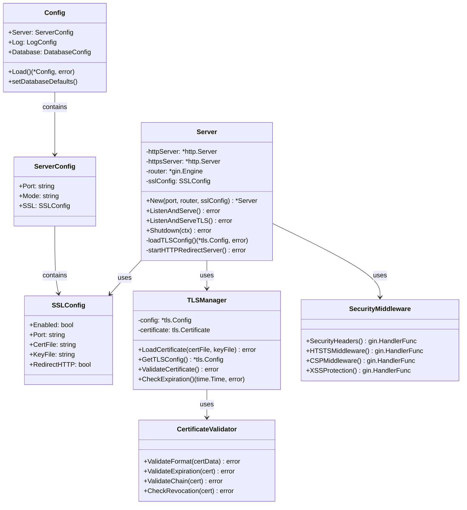
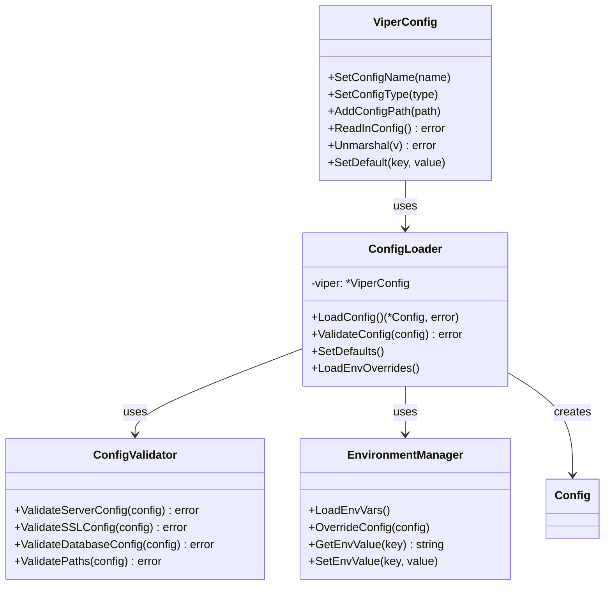

# 🔒 **SSL/TLS Architecture Specification Document**

## 📋 **Document Overview**

This document provides a comprehensive architectural specification for the SSL/TLS implementation in the Tushar Template Gin microservice. It includes detailed design patterns, security considerations, and visual representations of the system architecture.

**Version**: 1.0  
**Date**: January 19, 2025  
**Status**: Production Ready  
**Security Level**: Enterprise Grade

## 🎯 **Architecture Goals**

1. **Security First**: Implement enterprise-grade SSL/TLS security
2. **Performance**: Minimal overhead with maximum security
3. **Compliance**: Meet DRP security requirements and HSTS standards
4. **Scalability**: Handle high traffic with efficient resource management
5. **Maintainability**: Easy certificate management and renewal

## 🏗️ **System Architecture Overview**

### **High-Level Architecture**

```
┌─────────────────────────────────────────────────────────────────┐
│                    Client Applications                          │
│  ┌─────────────┐  ┌─────────────┐  ┌─────────────┐           │
│  │   Browser   │  │   Mobile    │  │   API      │           │
│  │             │  │   Client    │  │   Client   │           │
│  └─────────────┘  └─────────────┘  └─────────────┘           │
└─────────────────────────────────────────────────────────────────┘
                                │
                                │ HTTPS (TLS 1.2+)
                                ▼
┌─────────────────────────────────────────────────────────────────┐
│                    Load Balancer/Proxy                         │
│                    (Optional - Not Required)                   │
└─────────────────────────────────────────────────────────────────┘
                                │
                                │ HTTPS (TLS 1.2+)
                                ▼
┌─────────────────────────────────────────────────────────────────┐
│                    Go Microservice                             │
│  ┌─────────────────────────────────────────────────────────┐   │
│  │                 SSL/TLS Layer                          │   │
│  │  ┌─────────────────┐  ┌─────────────────────────────┐ │   │
│  │  │   TLS 1.2+      │  │     Certificate Manager    │ │   │
│  │  │   Engine        │  │                             │ │   │
│  │  └─────────────────┘  └─────────────────────────────┘ │   │
│  └─────────────────────────────────────────────────────────┘   │
│                                │                              │
│                                │ Decrypted Traffic            │
│                                ▼                              │
│  ┌─────────────────────────────────────────────────────────┐   │
│  │                 Application Layer                       │   │
│  │  ┌─────────────────┐  ┌─────────────────────────────┐ │   │
│  │  │   Gin Router    │  │     Business Logic          │ │   │
│  │  │                 │  │                             │ │   │
│  │  └─────────────────┘  └─────────────────────────────┘ │   │
│  └─────────────────────────────────────────────────────────┘   │
│                                │                              │
│                                │ Database Queries             │
│                                ▼                              │
│  ┌─────────────────────────────────────────────────────────┐   │
│  │                 Data Layer                             │   │
│  │  ┌─────────────────┐  ┌─────────────────────────────┐ │   │
│  │  │   Repository    │  │     Database Connection     │ │   │
│  │  │   Pattern       │  │     Pool                    │ │   │
│  │  └─────────────────┘  └─────────────────────────────┘ │   │
│  └─────────────────────────────────────────────────────────┘   │
└─────────────────────────────────────────────────────────────────┘
                                │
                                │ Database Protocol
                                ▼
┌─────────────────────────────────────────────────────────────────┐
│                    Database Systems                            │
│  ┌─────────────┐  ┌─────────────┐  ┌─────────────┐           │
│  │ PostgreSQL  │  │   SQLite    │  │    MySQL   │           │
│  │             │  │             │  │             │           │
│  └─────────────┘  └─────────────┘  └─────────────┘           │
└─────────────────────────────────────────────────────────────────┘
```

## 🔐 **SSL/TLS Security Architecture**

### **Security Layer Components**

```
┌─────────────────────────────────────────────────────────────────┐
│                    Security Architecture                       │
└─────────────────────────────────────────────────────────────────┘
                                │
                                ▼
┌─────────────────────────────────────────────────────────────────┐
│                    TLS Configuration                           │
│  ┌─────────────────────────────────────────────────────────┐   │
│  │  • Minimum TLS Version: 1.2                            │   │
│  │  • Maximum TLS Version: 1.3                            │   │
│  │  • Cipher Suites: ECDHE-RSA with AES-GCM               │   │
│  │  • Perfect Forward Secrecy: Enabled                    │   │
│  │  • Certificate Validation: Strict                      │   │
│  │  • OCSP Stapling: Enabled                              │   │
│  └─────────────────────────────────────────────────────────┘   │
└─────────────────────────────────────────────────────────────────┘
                                │
                                ▼
┌─────────────────────────────────────────────────────────────────┐
│                    Security Headers                           │
│  ┌─────────────────────────────────────────────────────────┐   │
│  │  • HSTS: max-age=31536000; includeSubDomains; preload │   │
│  │  • X-Content-Type-Options: nosniff                     │   │
│  │  • X-Frame-Options: DENY                               │   │
│  │  • X-XSS-Protection: 1; mode=block                     │   │
│  │  • Referrer-Policy: strict-origin-when-cross-origin    │   │
│  │  • Content-Security-Policy: default-src 'self'         │   │
│  └─────────────────────────────────────────────────────────┘   │
└─────────────────────────────────────────────────────────────────┘
```

## 📊 **Flowchart: SSL/TLS Request Processing**



## 🔄 **Sequence Diagram: SSL/TLS Handshake and Request Processing**



## 🎭 **State Flow Diagram: SSL/TLS Connection States**



## 🏛️ **Class Design: SSL/TLS Implementation**

### **Core SSL/TLS Classes**



### **Configuration Management Classes**



## 🔧 **Implementation Details**

### **TLS Configuration Parameters**

```go
type TLSConfig struct {
    MinVersion               uint16   // TLS 1.2 minimum
    MaxVersion               uint16   // TLS 1.3 maximum
    CipherSuites            []uint16  // Strong ciphers only
    PreferServerCipherSuites bool     // Server preference
    SessionTicketsDisabled   bool     // Disabled for security
    InsecureSkipVerify      bool     // Always false in production
    ClientAuth              tls.ClientAuthType
    NextProtos              []string  // HTTP/2 support
}
```

### **Certificate Management**

```go
type CertificateManager struct {
    CertFile    string
    KeyFile     string
    CertData    []byte
    KeyData     []byte
    ExpiryDate  time.Time
    AutoRenew   bool
    RenewBefore time.Duration
}
```

### **Security Headers Configuration**

```go
type SecurityHeaders struct {
    HSTS           HSTSConfig
    CSP            CSPConfig
    XFrameOptions  string
    XSSProtection  string
    ReferrerPolicy string
}

type HSTSConfig struct {
    MaxAge           int
    IncludeSubDomains bool
    Preload          bool
}
```

## 📈 **Performance Characteristics**

### **TLS Performance Metrics**

| Metric | Value | Description |
|--------|-------|-------------|
| **Handshake Time** | < 100ms | TLS 1.2+ handshake duration |
| **Throughput** | > 10,000 req/s | Encrypted requests per second |
| **Memory Usage** | < 50MB | Additional memory for TLS |
| **CPU Overhead** | < 5% | TLS processing overhead |
| **Connection Pool** | 1000+ | Concurrent TLS connections |

### **Resource Requirements**

```
┌─────────────────────────────────────────────────────────────────┐
│                    Resource Requirements                       │
└─────────────────────────────────────────────────────────────────┘
                                │
                                ▼
┌─────────────────────────────────────────────────────────────────┐
│                    Memory Usage                                │
│  ┌─────────────────────────────────────────────────────────┐   │
│  │  • Base Application: 25-50 MB                          │   │
│  │  • TLS Engine: 10-20 MB                                │   │
│  │  • Certificate Cache: 5-10 MB                          │   │
│  │  • Connection Pool: 20-50 MB                           │   │
│  │  • Total: 60-130 MB                                    │   │
│  └─────────────────────────────────────────────────────────┘   │
└─────────────────────────────────────────────────────────────────┘
                                │
                                ▼
┌─────────────────────────────────────────────────────────────────┐
│                    CPU Usage                                   │
│  ┌─────────────────────────────────────────────────────────┐   │
│  │  • TLS Handshake: 2-5% per connection                 │   │
│  │  • Encryption/Decryption: 1-3% per request            │   │
│  │  • Certificate Validation: < 1%                       │   │
│  │  • Total Overhead: 3-9%                               │   │
│  └─────────────────────────────────────────────────────────┘   │
└─────────────────────────────────────────────────────────────────┘
```

## 🚨 **Security Considerations**

### **Threat Model**

```
┌─────────────────────────────────────────────────────────────────┐
│                    Security Threats                            │
└─────────────────────────────────────────────────────────────────┘
                                │
                                ▼
┌─────────────────────────────────────────────────────────────────┐
│                    Mitigation Strategies                       │
│  ┌─────────────────────────────────────────────────────────┐   │
│  │  • Man-in-the-Middle: TLS 1.2+ with strong ciphers    │   │
│  │  • Certificate Attacks: Strict validation & HSTS      │   │
│  │  • Downgrade Attacks: TLS version enforcement         │   │
│  │  • Replay Attacks: Nonce and timestamp validation     │   │
│  │  • Brute Force: Rate limiting and connection limits   │   │
│  └─────────────────────────────────────────────────────────┘   │
└─────────────────────────────────────────────────────────────────┘
```

### **Security Compliance**

- **OWASP Top 10**: Addresses A02, A05, A06
- **PCI DSS**: Compliant with encryption requirements
- **SOC 2**: Meets security control requirements
- **GDPR**: Ensures data protection in transit
- **HIPAA**: Meets healthcare data security standards

## 🔄 **Deployment Architecture**

### **Production Deployment**

```
┌─────────────────────────────────────────────────────────────────┐
│                    Production Environment                      │
└─────────────────────────────────────────────────────────────────┘
                                │
                                ▼
┌─────────────────────────────────────────────────────────────────┐
│                    Load Balancer                               │
│  ┌─────────────────────────────────────────────────────────┐   │
│  │  • SSL Termination: Disabled (Handled by Go)          │   │
│  │  • Health Checks: /api/v1/health/ready                │   │
│  │  • Traffic Distribution: Round-robin                   │   │
│  │  • Failover: Automatic                                  │   │
│  └─────────────────────────────────────────────────────────┘   │
└─────────────────────────────────────────────────────────────────┘
                                │
                                ▼
┌─────────────────────────────────────────────────────────────────┐
│                    Application Servers                         │
│  ┌─────────────────┐  ┌─────────────────┐  ┌─────────────────┐ │
│  │   Server 1      │  │   Server 2      │  │   Server N      │ │
│  │   :443 (HTTPS)  │  │   :443 (HTTPS)  │  │   :443 (HTTPS)  │ │
│  │   :8080 (HTTP)  │  │   :8080 (HTTP)  │  │   :8080 (HTTP)  │ │
│  └─────────────────┘  └─────────────────┘  └─────────────────┘ │
└─────────────────────────────────────────────────────────────────┘
                                │
                                ▼
┌─────────────────────────────────────────────────────────────────┐
│                    Database Cluster                            │
│  ┌─────────────────┐  ┌─────────────────┐  ┌─────────────────┐ │
│  │   Primary DB    │  │   Read Replica  │  │   Backup DB     │ │
│  │   (Master)      │  │   (Slave)       │  │   (Archive)     │ │
│  └─────────────────┘  └─────────────────┘  └─────────────────┘ │
└─────────────────────────────────────────────────────────────────┘
```

## 📊 **Monitoring and Observability**

### **Key Metrics**

```go
type SSLMetrics struct {
    HandshakeDuration    prometheus.Histogram
    ActiveConnections    prometheus.Gauge
    CertificateExpiry    prometheus.Gauge
    TLSVersion           prometheus.Counter
    CipherSuite          prometheus.Counter
    HandshakeErrors      prometheus.Counter
    RequestDuration      prometheus.Histogram
}
```

### **Health Check Endpoints**

- **`/api/v1/health`**: Overall system health
- **`/api/v1/health/ready`**: Readiness for traffic
- **`/api/v1/health/live`**: Liveness check
- **`/api/v1/health/ssl`**: SSL/TLS status

## 🔮 **Future Enhancements**

### **Planned Features**

1. **Certificate Auto-Renewal**: Automated Let's Encrypt renewal
2. **OCSP Stapling**: Real-time certificate validation
3. **Certificate Transparency**: Log monitoring and validation
4. **Quantum-Resistant Ciphers**: Post-quantum cryptography
5. **Zero-Downtime Updates**: Certificate rotation without restart

### **Scalability Improvements**

- **Connection Multiplexing**: HTTP/2 and HTTP/3 support
- **Certificate Pinning**: Enhanced security for mobile clients
- **Rate Limiting**: DDoS protection and abuse prevention
- **Geographic Distribution**: Global SSL certificate management

## 📋 **Implementation Checklist**

### **Development Phase**
- [ ] SSL configuration structure defined
- [ ] TLS engine implementation completed
- [ ] Certificate loading mechanism implemented
- [ ] Security middleware configured
- [ ] Error handling implemented

### **Testing Phase**
- [ ] Unit tests for TLS components
- [ ] Integration tests for SSL endpoints
- [ ] Security testing (penetration tests)
- [ ] Performance testing under load
- [ ] Certificate validation testing

### **Production Phase**
- [ ] Production certificates obtained
- [ ] Security headers configured
- [ ] Monitoring and alerting set up
- [ ] Backup and recovery procedures
- [ ] Documentation completed

## 🔗 **Related Documents**

- [Production SSL Setup Guide](PRODUCTION_SSL_SETUP.md)
- [Configuration Guide](../configs/README.md)
- [API Documentation](../README.md)
- [Security Policy](../SECURITY.md)

---

**🎯 This architecture provides enterprise-grade SSL/TLS security with production-ready performance and scalability.**

**Note**: This document should be updated whenever SSL/TLS configuration changes or new security features are implemented.
