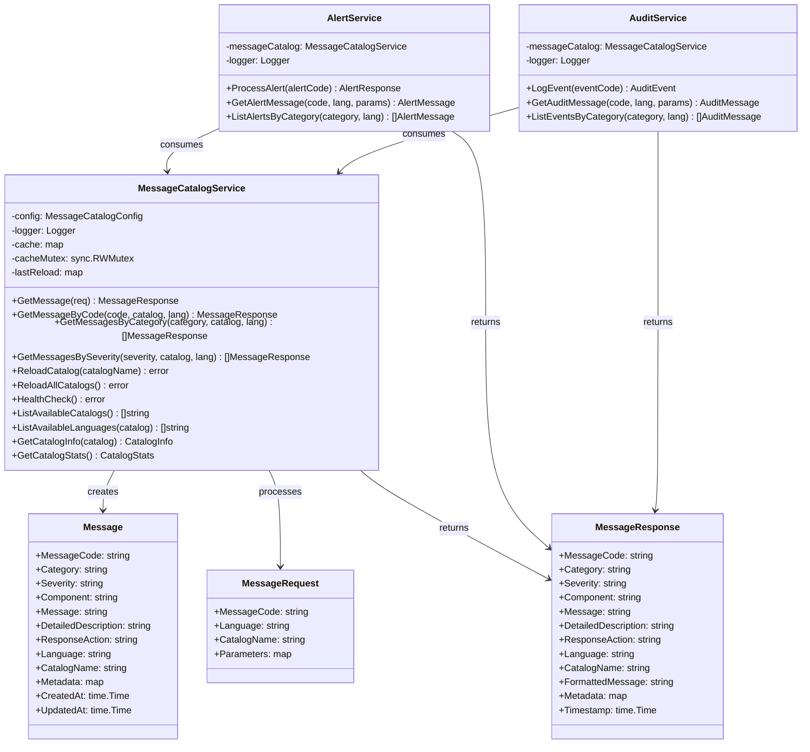
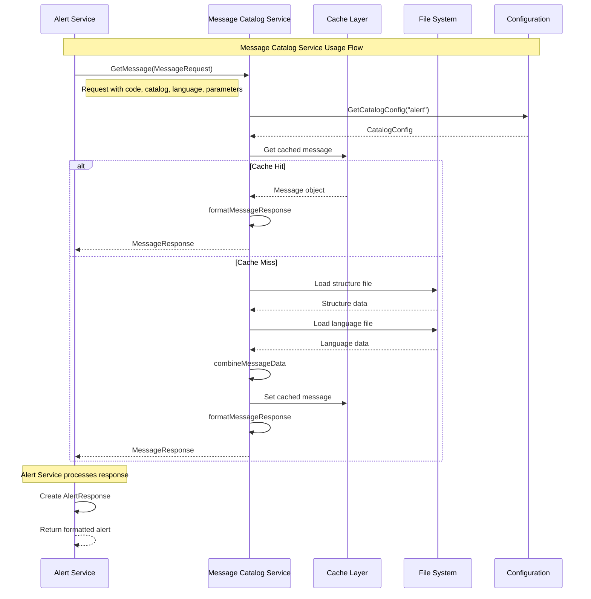
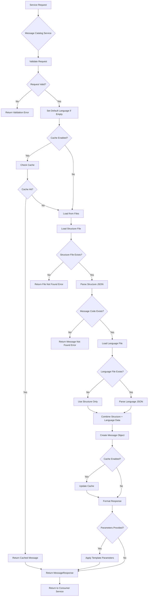
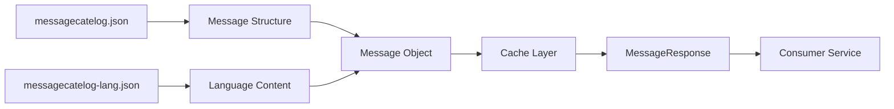
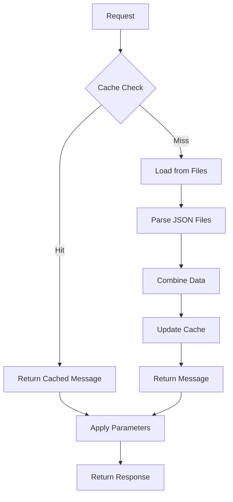
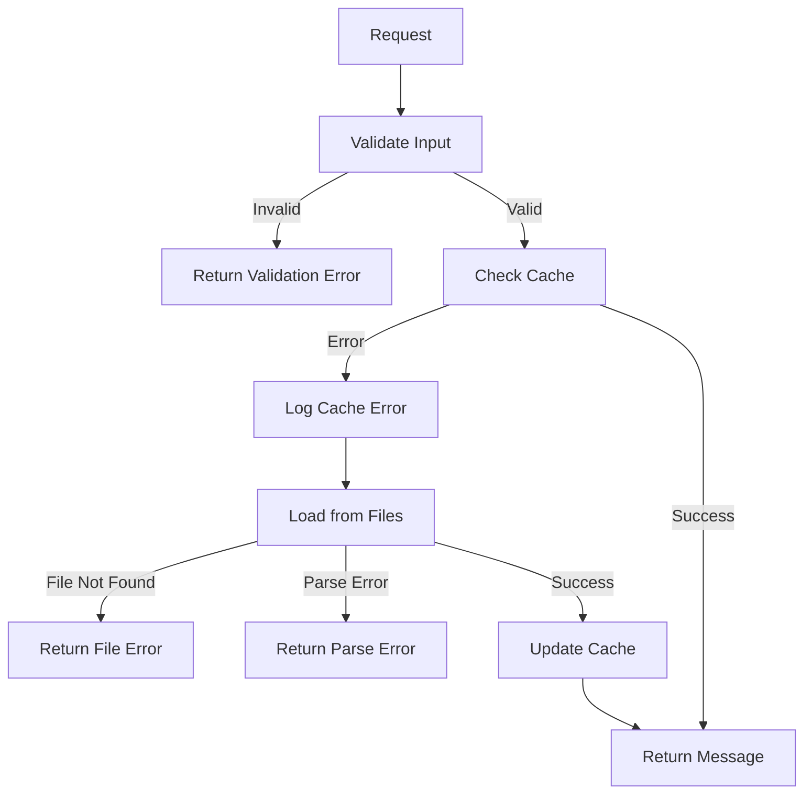

# Message Catalog Service - Design Document

## 📋 **Overview**

The Message Catalog Service is a generic, extensible service that manages message templates across multiple catalogs (Alert, Audit) with multi-language support. It combines structural message definitions with language-specific translations and provides template parameter substitution.

## 🏗️ **Architecture Principles**

- **Generic Design**: Single service handles multiple message catalogs
- **Language Support**: Multi-language with configurable fallbacks
- **Caching**: High-performance in-memory caching
- **Interface-Based**: Clean, testable interfaces
- **Configuration-Driven**: Easy to add new catalogs
- **Thread-Safe**: Concurrent access support

## 📊 **Class Diagram**



## 🔄 **Sequence Diagram**



## 🌊 **Flow Diagram**



## 📁 **File Structure & Data Flow**

### **Directory Structure**
```
pkg/
├── alert/
│   └── catalog/
│       ├── messagecatelog.json          # Structure definitions
│       ├── messagecatelog-en-US.json    # English translations
│       └── messagecatelog-fr-FR.json    # French translations
└── audit/
    └── catalog/
        ├── messagecatelog.json          # Structure definitions
        ├── messagecatelog-en-US.json    # English translations
        └── messagecatelog-fr-FR.json    # French translations
```

### **Data Flow**


## 🔧 **Configuration Schema**

### **Main Configuration (config.json)**
```json
{
  "message_catalog": {
    "default_language": "en-US",
    "supported_languages": ["en-US", "fr-FR", "es-ES"],
    "cache_enabled": true,
    "cache_ttl_seconds": 3600,
    "reload_interval_seconds": 300,
    "catalogs": [
      {
        "name": "alert",
        "path": "./pkg/alert/catalog",
        "enabled": true,
        "structure_file": "messagecatelog.json",
        "language_file_pattern": "messagecatelog-{lang}.json"
      },
      {
        "name": "audit",
        "path": "./pkg/audit/catalog",
        "enabled": true,
        "structure_file": "messagecatelog.json",
        "language_file_pattern": "messagecatelog-{lang}.json"
      }
    ]
  }
}
```

### **Structure File (messagecatelog.json)**
```json
{
  "ABC0001": {
    "message_code": "ABC0001",
    "category": "Registration",
    "severity": "CRITICAL",
    "component": "Reg"
  },
  "ABC0002": {
    "message_code": "ABC0002",
    "category": "Authentication",
    "severity": "HIGH",
    "component": "Auth"
  }
}
```

### **Language File (messagecatelog-en-US.json)**
```json
{
  "ABC0001": {
    "message": "Registration is about to expire",
    "detailed_description": "Registration is about to expire on {{.exp_date}}",
    "response_action": "Renew the registration before expiry"
  },
  "ABC0002": {
    "message": "Authentication failed",
    "detailed_description": "User authentication failed for user {{.username}} at {{.timestamp}}",
    "response_action": "Check credentials and try again"
  }
}
```

## 🚀 **Consumer Service Implementation**

### **1. Alert Service Implementation**

```go
// internal/domains/alert/service.go
package alert

import (
    "context"
    "time"
    
    "tushartemplategin/internal/domains/messagecatalog"
    "tushartemplategin/pkg/interfaces"
)

type AlertService struct {
    messageCatalog messagecatalog.Service
    logger         interfaces.Logger
}

func NewAlertService(messageCatalog messagecatalog.Service, logger interfaces.Logger) *AlertService {
    return &AlertService{
        messageCatalog: messageCatalog,
        logger:         logger,
    }
}

// ProcessAlert processes an alert and returns formatted response
func (s *AlertService) ProcessAlert(ctx context.Context, alertCode string, parameters map[string]interface{}) (*AlertResponse, error) {
    s.logger.Info(ctx, "Processing alert", interfaces.Fields{
        "alert_code": alertCode,
        "parameters": parameters,
    })
    
    // Get message from catalog
    req := &messagecatalog.MessageRequest{
        MessageCode: alertCode,
        CatalogName: "alert",
        Language:    "en-US", // Could be configurable
        Parameters:  parameters,
    }
    
    message, err := s.messageCatalog.GetMessage(ctx, req)
    if err != nil {
        s.logger.Error(ctx, "Failed to get alert message", interfaces.Fields{
            "alert_code": alertCode,
            "error":      err.Error(),
        })
        return nil, err
    }
    
    // Convert to alert-specific response
    response := &AlertResponse{
        Code:        message.MessageCode,
        Category:    message.Category,
        Severity:    message.Severity,
        Component:   message.Component,
        Message:     message.FormattedMessage,
        Description: message.DetailedDescription,
        Action:      message.ResponseAction,
        Language:    message.Language,
        Timestamp:   time.Now(),
    }
    
    s.logger.Info(ctx, "Alert processed successfully", interfaces.Fields{
        "alert_code": alertCode,
        "category":   message.Category,
        "severity":   message.Severity,
    })
    
    return response, nil
}

// AlertResponse represents the response for an alert
type AlertResponse struct {
    Code        string            `json:"code"`
    Category    string            `json:"category"`
    Severity    string            `json:"severity"`
    Component   string            `json:"component"`
    Message     string            `json:"message"`
    Description string            `json:"description"`
    Action      string            `json:"action"`
    Language    string            `json:"language"`
    Timestamp   time.Time         `json:"timestamp"`
}
```

### **2. Audit Service Implementation**

```go
// internal/domains/audit/service.go
package audit

import (
    "context"
    "time"
    
    "tushartemplategin/internal/domains/messagecatalog"
    "tushartemplategin/pkg/interfaces"
)

type AuditService struct {
    messageCatalog messagecatalog.Service
    logger         interfaces.Logger
}

func NewAuditService(messageCatalog messagecatalog.Service, logger interfaces.Logger) *AuditService {
    return &AuditService{
        messageCatalog: messageCatalog,
        logger:         logger,
    }
}

// LogEvent logs an audit event and returns formatted response
func (s *AuditService) LogEvent(ctx context.Context, eventCode string, parameters map[string]interface{}) (*AuditEvent, error) {
    s.logger.Info(ctx, "Logging audit event", interfaces.Fields{
        "event_code": eventCode,
        "parameters": parameters,
    })
    
    // Get message from catalog
    req := &messagecatalog.MessageRequest{
        MessageCode: eventCode,
        CatalogName: "audit",
        Language:    "en-US", // Could be configurable
        Parameters:  parameters,
    }
    
    message, err := s.messageCatalog.GetMessage(ctx, req)
    if err != nil {
        s.logger.Error(ctx, "Failed to get audit message", interfaces.Fields{
            "event_code": eventCode,
            "error":      err.Error(),
        })
        return nil, err
    }
    
    // Convert to audit-specific response
    event := &AuditEvent{
        EventCode:     message.MessageCode,
        EventCategory: message.Category,
        RiskLevel:     message.Severity,
        Component:     message.Component,
        Description:   message.FormattedMessage,
        Details:       message.DetailedDescription,
        Action:        message.ResponseAction,
        Language:      message.Language,
        Timestamp:     time.Now(),
    }
    
    s.logger.Info(ctx, "Audit event logged successfully", interfaces.Fields{
        "event_code": eventCode,
        "category":   message.Category,
        "risk_level": message.Severity,
    })
    
    return event, nil
}

// AuditEvent represents an audit event
type AuditEvent struct {
    EventCode     string            `json:"event_code"`
    EventCategory string            `json:"event_category"`
    RiskLevel     string            `json:"risk_level"`
    Component     string            `json:"component"`
    Description   string            `json:"description"`
    Details       string            `json:"details"`
    Action        string            `json:"action"`
    Language      string            `json:"language"`
    Timestamp     time.Time         `json:"timestamp"`
}
```

## 📊 **Performance & Caching Strategy**

### **Cache Architecture**


### **Cache Key Strategy**
- Format: `{catalog_name}:{message_code}:{language}`
- Examples:
  - `alert:ABC0001:en-US`
  - `audit:AUD0001:fr-FR`

## 🔒 **Error Handling Strategy**

### **Error Types**
1. **Validation Errors**: Invalid request parameters
2. **File Not Found**: Missing catalog or language files
3. **Parse Errors**: Invalid JSON format
4. **Message Not Found**: Message code doesn't exist
5. **Cache Errors**: Cache operation failures

### **Error Flow**


## 🧪 **Testing Strategy**

### **Unit Tests**
- Message parsing and combination
- Cache operations
- Parameter substitution
- Error handling

### **Integration Tests**
- End-to-end message retrieval
- Multi-language support
- Cache invalidation
- Service consumption

### **Performance Tests**
- Cache hit/miss ratios
- Memory usage
- Response times
- Concurrent access

## 📈 **Monitoring & Metrics**

### **Key Metrics**
- Cache hit ratio
- Response time
- Memory usage
- Error rates
- Catalog reload frequency

### **Health Checks**
- File accessibility
- Cache health
- Service availability
- Configuration validity

## 🎯 **Key Benefits**

1. **✅ Generic & Extensible** - Handles any number of catalogs
2. **✅ Language Support** - Multi-language with fallback
3. **✅ Template Support** - Parameter substitution in messages
4. **✅ Caching** - High-performance in-memory caching
5. **✅ Interface-Based** - Clean, testable interfaces
6. **✅ Configuration-Driven** - Easy to add new catalogs
7. **✅ Error Handling** - Comprehensive error management
8. **✅ Thread-Safe** - Concurrent access support

This design provides a robust, scalable, and maintainable Message Catalog service that can be easily consumed by Alert and Audit services while supporting future extensions.
